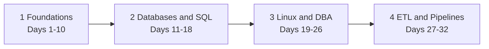
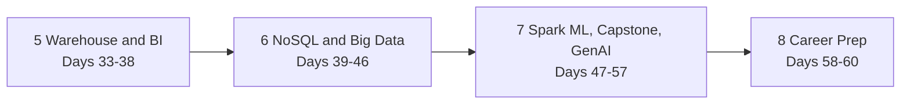
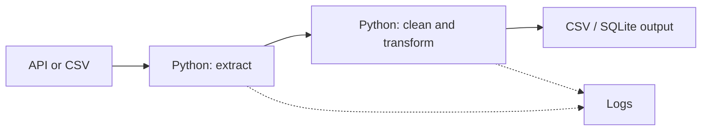
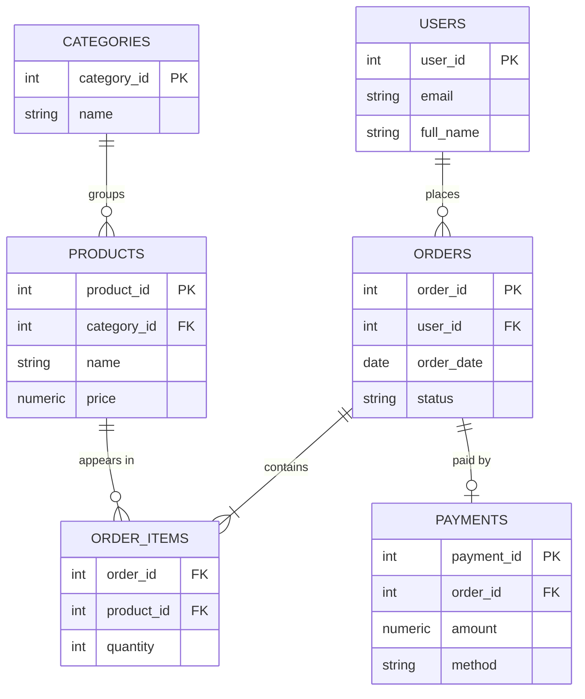
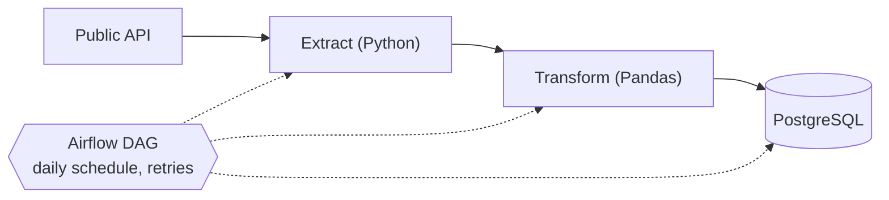
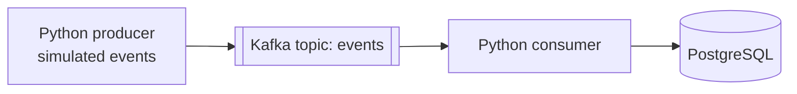
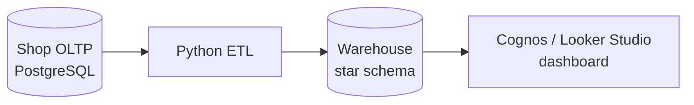
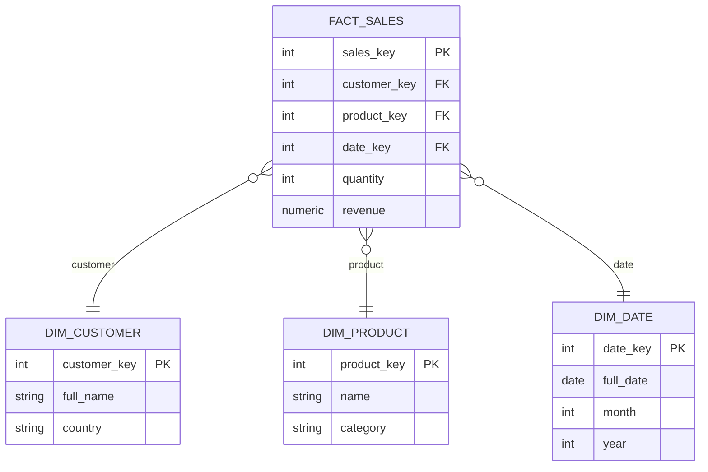
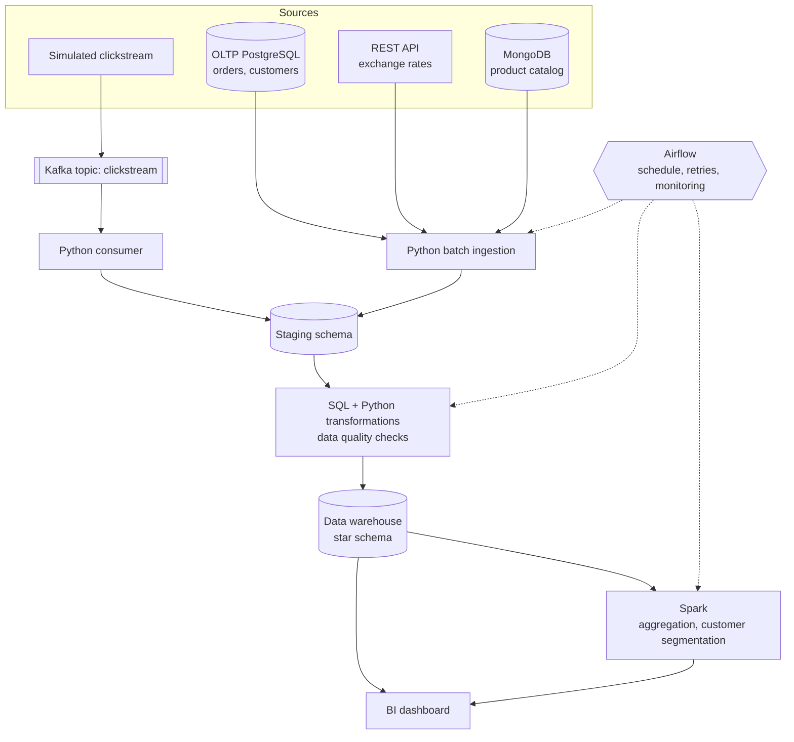
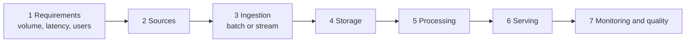

# Data Engineering — 60-Day Roadmap

<aside>
💡 **Notion tips** Type `/table of contents` at the top of this page for a clickable outline. Import `notion_days_database.csv` to get a 60-row progress tracker (change the Status column to the Status type). Each day below is a toggle.
</aside>

## Overview

A 60-day, hands-on study plan for **two study partners** who want to complete a 16-course Data Engineering curriculum and finish with a portfolio they can show to employers. The plan optimizes for **understanding and retention**, not for finishing videos.

### At a Glance

| Item | Value |
| --- | --- |
| Duration | 60 days (about 8.5 weeks) |
| Study days | 52 days (average 6.6 h per day) |
| Flex / review days | 8 days (every 7th day: Days 7, 14, 21, 28, 35, 42, 49, 56) |
| Courses | 16 |
| Course content tracked | 262 h (see the note below) |
| Planned total study time | about 365 h including flex days |
| Learners | 2 (both learn every topic) |
| Deliverables | 5 mini projects, 1 capstone, weekly reviews, GitHub portfolio |

<aside>
⚠️ **Course hours: 262, not 272** The 16 course durations in the curriculum add up to **262 hours**, not 272. This roadmap tracks the real sum (262 h) and every day shows a running total. If your platform shows 272 h in total (for example one course is longer than listed), absorb the extra 10 h on flex Days 21, 35 and 49.
</aside>

### How to Use This Roadmap

- Open the day you are on, follow the **Topics**, do the **Daily Task** and finish the **Deliverable**.
- Tick the daily checklist. A day is done only when the deliverable exists on GitHub.
- Meet for the **Joint Study Session**: the day's explainer teaches, you both solve, review and quiz.
- On flex days, complete the **Weekly Review** and catch up. Rest if you are on track.
- Topics marked **supplementary** are not part of the listed courses but are needed for the job.

### Daily Entry Format

| Field | Meaning |
| --- | --- |
| Course / Duration | Which course and how many course hours the day covers (with a running total) |
| Theory | Videos (at 1.25x speed) plus notes written in your own words |
| Hands-on Practice | Course labs plus extra coding, SQL and project work |
| Joint Study Session | Pair session with a rotating explainer |
| Daily Task / Deliverable | One concrete task and the file or repo that must exist at the end |
| Review Questions | Questions you should answer without looking at notes |

## Curriculum

| # | Course | Hours | Phase | Days | Cumulative |
| ---: | --- | ---: | ---: | ---: | ---: |
| 1 | Introduction to Data Engineering | 14 h | 1 | 1–3 | 14 h |
| 2 | Python for Data Science, AI & Development | 24 h | 1 | 4–8 | 38 h |
| 3 | Python Project for Data Engineering | 10 h | 1 | 9–10 | 48 h |
| 4 | Introduction to Relational Databases (RDBMS) | 16 h | 2 | 11–13 | 64 h |
| 5 | Databases and SQL for Data Science with Python | 18 h | 2 | 15–18 | 82 h |
| 6 | Hands-on Introduction to Linux Commands and Shell Scripting | 17 h | 3 | 19–22 | 99 h |
| 7 | Relational Database Administration (DBA) | 21 h | 3 | 23–26 | 120 h |
| 8 | ETL and Data Pipelines with Shell, Airflow and Kafka | 18 h | 4 | 27–32 | 138 h |
| 9 | Data Warehouse Fundamentals | 16 h | 5 | 33–36 | 154 h |
| 10 | BI Dashboards with IBM Cognos Analytics and Google Looker | 12 h | 5 | 37–38 | 166 h |
| 11 | Introduction to NoSQL Databases | 18 h | 6 | 39–41 | 184 h |
| 12 | Introduction to Big Data with Spark and Hadoop | 20 h | 6 | 43–46 | 204 h |
| 13 | Machine Learning with Apache Spark | 16 h | 7 | 47–50 | 220 h |
| 14 | Data Engineering Capstone Project | 18 h | 7 | 51–53 | 238 h |
| 15 | Generative AI: Elevate your Data Engineering Career | 13 h | 7 | 54–57 | 251 h |
| 16 | Data Engineering Career Guide and Interview Preparation | 11 h | 8 | 58–60 | 262 h |
|  | **Total** | **262 h** |  |  |  |

Days shown are the first and last day on which the course appears. Some courses are interleaved with practice and projects.

### Supplementary Topics (Not in the Listed Courses)

- CTEs, window functions and index tuning (Day 18)
- pytest and basic testing of pipelines (Days 10 and 26)
- Docker and Docker Compose for local environments (Days 3, 29, 31)
- Interview drills, pipeline design practice and portfolio review (Days 58–60)

## 60-Day Strategy

### Reality Check: the Time Budget

<aside>
⚠️ **Read this first** The brief assumes 5–6 focused hours per study day. With 262 course hours plus hands-on practice and projects, that is not enough on every day. This plan uses **6 to 7 hours on study days (average 6.6 h)** and **3 hours on flex days**. If you can only study 5.5 h per day, keep the hands-on work and projects, skim the optional readings, and extend the plan to about 70 days.
</aside>

| Day type | Course hours | Total time | Theory | Hands-on | Pair |
| --- | --- | --- | --- | --- | --- |
| Heavy course day | 6 | 7 h | 3 h | 3 h | 1 h |
| Standard course day | 5 | 6.5 h | 2.5 h | 3 h | 1 h |
| Practice / project day | 3–4 | 6 h | 1.5–2 h | 3–3.5 h | 1–1.5 h |
| Flex / review day | 0 | 3 h | 0 h | 1.5 h | 1.5 h |

### Where the Time Goes

| Block | Planned hours | Share |
| --- | ---: | ---: |
| Theory (videos at 1.25x and notes) | 131 h | 36% |
| Hands-on (labs, coding, SQL, projects) | 157.5 h | 43% |
| Pair sessions and weekly reviews | 76.5 h | 21% |
| **Total** | **365 h** | **100%** |

### How the Seven Activities Are Balanced

| Activity | Approximate share | Where it happens |
| --- | ---: | --- |
| 1. Course videos | 28% | Theory block, every course day |
| 2. Notes | 7% | End of each video block, in your own words |
| 3. Coding practice | 20% | Python, Bash, Spark, Airflow, Kafka labs |
| 4. SQL practice | 12% | Phase 2 daily; Phases 3, 5 and 6 review queries |
| 5. Projects | 20% | Five mini projects and the capstone |
| 6. Review | 8% | Pair sessions and flex-day weekly reviews |
| 7. Interview preparation | 5% | Phase 8 plus one interview question in each pair session |

The shares are targets, not measurements. Course hours come from the course clock (videos, readings, labs and quizzes together), so they are already partly hands-on.

### Difficulty Weighting (Not an Equal Split)

| Phase | Name | Days | Course | Planned | Ratio | Why |
| ---: | --- | ---: | ---: | ---: | ---: | --- |
| 1 | Foundations | 1–10 | 48 h | 63 h | 1.3x | Fundamentals are quick; Python needs steady repetition |
| 2 | Databases & SQL | 11–18 | 34 h | 48.5 h | 1.4x | SQL needs daily practice more than video time |
| 3 | Linux & DBA | 19–26 | 38 h | 50 h | 1.3x | Linux labs move fast; DBA needs runbooks |
| 4 | ETL & Data Pipelines | 27–32 | 18 h | 33 h | 1.8x | Airflow and Kafka are hard; two projects built here |
| 5 | Data Warehouse & BI | 33–38 | 28 h | 37 h | 1.3x | Modelling needs design time; BI needs tool access |
| 6 | NoSQL & Big Data | 39–46 | 38 h | 50 h | 1.3x | New paradigms: NoSQL, Hadoop, Spark |
| 7 | Spark ML, Capstone & Generative AI | 47–57 | 47 h | 65.5 h | 1.4x | Spark ML plus the capstone build |
| 8 | Final Review & Career Preparation | 58–60 | 11 h | 18 h | 1.6x | Interview drills replace new content |

Ratio = planned study time divided by course hours. Phase 4 has the highest ratio because Airflow and Kafka take much longer to practice than to watch.

### Phase Timeline





### Why the Phase Ranges Changed

The suggested ranges would put Phase 7 (Spark ML, capstone and Generative AI, 47 course hours) into five days, which means about 12 course hours per day. The ranges were rebalanced so that every phase stays close to 5 course hours per study day.

| Phase | Suggested days | Days used |
| --- | --- | --- |
| 1 Foundations | 1–10 | 1–10 |
| 2 Databases & SQL | 11–20 | 11–18 |
| 3 Linux & DBA | 21–27 | 19–26 |
| 4 ETL & Data Pipelines | 28–38 | 27–32 |
| 5 Data Warehouse & BI | 39–45 | 33–38 |
| 6 NoSQL & Big Data | 46–53 | 39–46 |
| 7 Spark ML, Capstone & GenAI | 54–58 | 47–57 |
| 8 Final Review & Career | 59–60 | 58–60 |

### Two-Person Study System

Each day has three parts. Everything is done by both students.

| Part | What happens | Time |
| --- | --- | --- |
| Individual Study | Each person studies the course material independently and takes their own notes | Theory + hands-on |
| Pair Session | Explain, solve, review code, compare notes, debug and ask interview questions | 1 to 1.5 h |
| Teaching Rotation | One person is the explainer for the day and teaches selected concepts | Inside the pair session |

#### Pair Session Agenda (60 Minutes)

| Minutes | Activity | Rule |
| --- | --- | --- |
| 0–10 | Recap: what did each of us learn today? | No notes for the first 5 minutes |
| 10–25 | Explainer teaches the day's concept | One diagram, one example, 3 questions |
| 25–40 | Solve one problem together | Driver and navigator, swap after 10 minutes |
| 40–50 | Code review and debugging | Review the partner's code, not your own |
| 50–60 | Interview question and plan for tomorrow | Answer out loud, then compare |

#### Teaching Rotation

- **Odd study days:** Student A is the explainer. **Even study days:** Student B is the explainer.
- On flex days both students explain their weakest topic of the week.
- The explainer picks the concept listed in the day's pair session (marked *Explainer* in the daily plan).
- The listener asks **why** at least three times and must be able to repeat the idea afterwards.

#### Why This Improves Retention

- **Retrieval practice:** explaining without notes forces recall, which strengthens memory more than rereading.
- **Teaching effect:** preparing to teach makes you organize the idea and exposes gaps you did not notice.
- **Spaced review:** concepts return in the daily quiz, the weekly review and interview drills.
- **Error detection:** a partner spots wrong assumptions and bugs earlier than you do alone.
- **Accountability:** a fixed daily session keeps both people on schedule.

<aside>
💬 **بالعربي:** الشرح لزميلك هو أقوى طريقة للحفظ. لو مش قادر تشرح الفكرة بكلامك بدون ملاحظات، يبقى لسه ما فهمتهاش كويس.
</aside>

### Rules of the Roadmap

- **Practice before perfection:** if you must cut something, cut optional reading, never hands-on work.
- **Type every command** yourself. Do not copy and paste from the lab.
- **Commit every day.** Small commits with clear messages.
- **Write notes in your own words** in the notes repository.
- **Do not skip quizzes.** They are free retrieval practice.
- **Use flex days honestly:** review first, catch up second, rest third.

### If You Fall Behind

| Priority | Keep | Cut first |
| --- | --- | --- |
| Must keep | Daily task, deliverable, pair session, all projects |  |
| Can shrink | Video time (use 1.5x speed), note length | Duplicate explanations of topics you know |
| Cut first |  | Optional readings, repeated graded quizzes, extra tool tours |

## Phase 1 — Foundations

| Item | Detail |
| --- | --- |
| Days | 1–10 (9 study days, 1 flex) |
| Courses | 1. Introduction to Data Engineering; 2. Python for Data Science, AI & Development; 3. Python Project for Data Engineering |
| Course hours | 48 h |
| Planned study time | 63 h |
| Main project | Mini Project 1: Python Data Processing Pipeline |

**Goal:** Build a solid base: data engineering concepts, Python, files, APIs, JSON, CSV and Pandas. End with a working Python pipeline.

**Concepts covered:**

- Data engineering fundamentals
- Python and Python for data science
- Files, CSV and JSON
- APIs and web scraping
- Pandas and basic data manipulation
- Extract, transform, load in Python

**Days at a glance:**

| Day | Focus | Course # | Course h |
| ---: | --- | ---: | ---: |
| 1 | Data Engineering Foundations | 1 | 5 h |
| 2 | Data Repositories, Pipelines & Platforms | 1 | 5 h |
| 3 | Big Data Tools Overview, Career Map & Tooling Setup | 1 | 4 h |
| 4 | Python Fundamentals | 2 | 6 h |
| 5 | Files, Exceptions & Object-Oriented Basics | 2 | 6 h |
| 6 | NumPy & Pandas Foundations | 2 | 6 h |
| 7 | Weekly Review & Catch-up (Week 1) | – | – |
| 8 | Data Wrangling, APIs & Web Scraping | 2 | 6 h |
| 9 | Python Project for DE: Extract & Transform | 3 | 5 h |
| 10 | Python Project for DE: Load, Tests & Mini Project 1 | 3 | 5 h |

<aside>
🎯 **Phase 1 Milestone** - [ ] Repository `de-60-day-notes` created
- [ ] Mini Project 1 tagged `v1.0`
- [ ] Both students can explain the data engineering lifecycle
- [ ] Pandas cleaning script pushed to GitHub
</aside>

## Phase 2 — Databases & SQL

| Item | Detail |
| --- | --- |
| Days | 11–18 (7 study days, 1 flex) |
| Courses | 4. Introduction to Relational Databases (RDBMS); 5. Databases and SQL for Data Science with Python |
| Course hours | 34 h |
| Planned study time | 48.5 h |
| Main project | Mini Project 2: SQL Database Project |

**Goal:** Understand relational databases deeply and write confident SQL, from basic queries to window functions.

**Concepts covered:**

- RDBMS and relational modelling
- ER diagrams, primary and foreign keys, relationships
- Normalization
- SQL: joins, aggregations, subqueries
- CTEs and window functions (supplementary)
- Transactions and indexes

<aside>
💬 **بالعربي:** التطبيع (Normalization) معناه إنك تقسم البيانات على جداول عشان متتكررش المعلومة في أكتر من مكان، فتقل الأخطاء وتبقى البيانات أنضف.
</aside>

**Days at a glance:**

| Day | Focus | Course # | Course h |
| ---: | --- | ---: | ---: |
| 11 | Relational Database Concepts | 4 | 5 h |
| 12 | DDL, DML & Table Relationships | 4 | 5 h |
| 13 | ER Modelling & Normalization | 4 | 6 h |
| 14 | Weekly Review & Catch-up (Week 2) | – | – |
| 15 | SQL Fundamentals | 5 | 5 h |
| 16 | Joins, Subqueries & Views | 5 | 5 h |
| 17 | Transactions, Stored Procedures & SQL from Python | 5 | 5 h |
| 18 | Supplementary SQL (CTEs, Window Functions, Indexes) & Mini Project 2 | 5 | 3 h |

<aside>
🎯 **Phase 2 Milestone** - [ ] ERD and schema for Users, Orders, Products, Payments
- [ ] 25 documented queries including 5 CTEs and 5 window functions
- [ ] Python script that queries PostgreSQL
- [ ] Mini Project 2 tagged `v1.0`
</aside>

## Phase 3 — Linux & DBA

| Item | Detail |
| --- | --- |
| Days | 19–26 (7 study days, 1 flex) |
| Courses | 6. Hands-on Introduction to Linux Commands and Shell Scripting; 7. Relational Database Administration (DBA) |
| Course hours | 38 h |
| Planned study time | 50 h |
| Main project | Linux + DBA Toolkit (nightly backup script) |

**Goal:** Become comfortable in the Linux terminal and learn the day-to-day tasks of a database administrator.

**Concepts covered:**

- Linux commands, processes and permissions
- Pipes and redirection
- Shell scripting and cron
- Database users, roles and privileges
- Backup and restore
- Performance monitoring and tuning

**Days at a glance:**

| Day | Focus | Course # | Course h |
| ---: | --- | ---: | ---: |
| 19 | Linux Basics | 6 | 6 h |
| 20 | Text Processing, Pipes & Redirection | 6 | 6 h |
| 21 | Weekly Review & Catch-up (Week 3) | – | – |
| 22 | Shell Scripting, Processes & Cron | 6 | 5 h |
| 23 | DBA Fundamentals & Access Control | 7 | 6 h |
| 24 | Backup, Restore & Recovery | 7 | 5 h |
| 25 | Monitoring, Performance & Tuning | 7 | 5 h |
| 26 | Automation, Troubleshooting & Linux + DBA Toolkit | 7 | 5 h |

<aside>
🎯 **Phase 3 Milestone** - [ ] 100k-line log analysed with a pipeline
- [ ] Roles created and tested in PostgreSQL
- [ ] Backup and restore runbook tested
- [ ] Nightly backup script with rotation scheduled in cron
</aside>

## Phase 4 — ETL & Data Pipelines

| Item | Detail |
| --- | --- |
| Days | 27–32 (5 study days, 1 flex) |
| Courses | 8. ETL and Data Pipelines with Shell, Airflow and Kafka |
| Course hours | 18 h |
| Planned study time | 33 h |
| Main project | Mini Project 3 (ETL with Airflow) and Mini Project 4 (Kafka streaming) |

**Goal:** Build real pipelines: batch ETL orchestrated by Airflow and a streaming pipeline with Kafka.

**Concepts covered:**

- ETL and ELT
- Data ingestion and transformation
- Airflow: DAGs, tasks, operators, scheduling
- Kafka: topics, producers, consumers
- Batch vs. streaming concepts

<aside>
💬 **بالعربي:** ETL: بتسحب الداتا، تنضفها وتحولها، وبعدين تحمّلها. أما ELT فبتحمّل الأول وبتحوّل جوه المخزن نفسه. و Kafka زي «خط بريد» بيوصّل الأحداث من المنتج للمستهلك.
</aside>

**Days at a glance:**

| Day | Focus | Course # | Course h |
| ---: | --- | ---: | ---: |
| 27 | ETL Fundamentals with Shell | 8 | 4 h |
| 28 | Weekly Review & Catch-up (Week 4) | – | – |
| 29 | Data Pipelines & Apache Airflow Basics | 8 | 4 h |
| 30 | Airflow in Practice & Mini Project 3 | 8 | 4 h |
| 31 | Kafka Fundamentals | 8 | 3 h |
| 32 | Streaming ETL & Mini Project 4 | 8 | 3 h |

<aside>
🎯 **Phase 4 Milestone** - [ ] Airflow DAG runs green with retries
- [ ] Idempotent load into PostgreSQL
- [ ] Kafka producer and consumer working end to end
- [ ] READMEs with architecture diagrams
</aside>

## Phase 5 — Data Warehouse & BI

| Item | Detail |
| --- | --- |
| Days | 33–38 (5 study days, 1 flex) |
| Courses | 9. Data Warehouse Fundamentals; 10. BI Dashboards with IBM Cognos Analytics and Google Looker |
| Course hours | 28 h |
| Planned study time | 37 h |
| Main project | Mini Project 5: Data Warehouse + BI |

**Goal:** Design a data warehouse and present the results in BI dashboards.

**Concepts covered:**

- Data warehouse fundamentals
- OLTP vs. OLAP
- Fact and dimension tables
- Star and snowflake schemas
- Data marts
- BI, KPIs, dashboards and visualization

<aside>
💬 **بالعربي:** Star Schema: جدول حقائق (Fact) في النص بالأرقام، وحواليه جداول أبعاد (Dimensions) بتوصف الأرقام دي: مين، إيه، إمتى.
</aside>

**Days at a glance:**

| Day | Focus | Course # | Course h |
| ---: | --- | ---: | ---: |
| 33 | Data Warehouse Fundamentals | 9 | 6 h |
| 34 | Dimensional Modelling: Facts, Dimensions & Schemas | 9 | 6 h |
| 35 | Weekly Review & Catch-up (Week 5) | – | – |
| 36 | Warehouse ETL, OLAP & Performance | 9 | 4 h |
| 37 | BI Fundamentals & IBM Cognos Analytics | 10 | 6 h |
| 38 | Google Looker Dashboards & Mini Project 5 | 10 | 6 h |

<aside>
🎯 **Phase 5 Milestone** - [ ] Star schema designed and loaded
- [ ] OLAP-style queries written
- [ ] Dashboard with 4 KPIs (Cognos and Looker)
- [ ] Mini Project 5 tagged `v1.0`
</aside>

## Phase 6 — NoSQL & Big Data

| Item | Detail |
| --- | --- |
| Days | 39–46 (7 study days, 1 flex) |
| Courses | 11. Introduction to NoSQL Databases; 12. Introduction to Big Data with Spark and Hadoop |
| Course hours | 38 h |
| Planned study time | 50 h |
| Main project | Spark aggregation job and NoSQL decision matrix |

**Goal:** Learn when and how to use NoSQL, then move to distributed processing with Hadoop and Spark.

**Concepts covered:**

- NoSQL: document, key-value, wide-column
- MongoDB concepts
- Hadoop, HDFS and MapReduce
- Spark: DataFrames and Spark SQL
- Distributed computing, partitioning and lazy evaluation

<aside>
💬 **بالعربي:** Lazy Evaluation في Spark: الأوامر بتتسجل بس ومش بتتنفذ إلا لما تطلب نتيجة (Action). كده Spark يقدر يحسّن الخطة كلها قبل التنفيذ.
</aside>

**Days at a glance:**

| Day | Focus | Course # | Course h |
| ---: | --- | ---: | ---: |
| 39 | NoSQL Concepts & Types | 11 | 6 h |
| 40 | Document Databases: MongoDB | 11 | 6 h |
| 41 | Wide-Column & Key-Value Stores | 11 | 6 h |
| 42 | Weekly Review & Catch-up (Week 6) | – | – |
| 43 | Big Data & the Hadoop Ecosystem | 12 | 4 h |
| 44 | Spark Foundations: RDDs & DataFrames | 12 | 5 h |
| 45 | Spark SQL, Partitioning & Performance | 12 | 6 h |
| 46 | Spark on Clusters & Phase 6 Wrap-up | 12 | 5 h |

<aside>
🎯 **Phase 6 Milestone** - [ ] MongoDB queries and aggregations written
- [ ] HDFS word-count executed
- [ ] Spark job runs with `spark-submit`
- [ ] CSV vs. Parquet performance comparison documented
</aside>

## Phase 7 — Spark ML, Capstone & Generative AI

| Item | Detail |
| --- | --- |
| Days | 47–57 (9 study days, 2 flex) |
| Courses | 13. Machine Learning with Apache Spark; 14. Data Engineering Capstone Project; 15. Generative AI: Elevate your Data Engineering Career |
| Course hours | 47 h |
| Planned study time | 65.5 h |
| Main project | Final Capstone: E-commerce Analytics Platform |

**Goal:** Apply Spark ML, build the end-to-end capstone and learn how Generative AI fits into a data engineer's workflow.

**Concepts covered:**

- Spark ML and feature engineering
- ML pipelines, tuning and batch scoring
- Capstone project (course capstone plus our own)
- Generative AI for data engineering

**Days at a glance:**

| Day | Focus | Course # | Course h |
| ---: | --- | ---: | ---: |
| 47 | Spark ML: Data Preparation & Feature Engineering | 13 | 5 h |
| 48 | ML Pipelines: Classification & Clustering | 13 | 6 h |
| 49 | Weekly Review & Capstone Design (Week 7) | – | – |
| 50 | Model Tuning, Persistence & Scoring in Pipelines | 13 | 5 h |
| 51 | Capstone I: Requirements, Architecture & Ingestion | 14 | 6 h |
| 52 | Capstone II: Warehouse, ETL & Orchestration | 14 | 6 h |
| 53 | Capstone III: Analytics, Spark & Dashboard | 14 | 6 h |
| 54 | Generative AI Foundations for Data Engineers | 15 | 4 h |
| 55 | Generative AI in the Data Engineering Workflow | 15 | 5 h |
| 56 | Weekly Review & Capstone Polish (Week 8) | – | – |
| 57 | Generative AI Wrap-up & Capstone Release | 15 | 4 h |

<aside>
🎯 **Phase 7 Milestone** - [ ] Capstone architecture documented
- [ ] Ingestion, warehouse and dashboard working
- [ ] Capstone tagged `v1.0` with demo
- [ ] AI-assisted review report with verified changes only
</aside>

## Phase 8 — Final Review & Career Preparation

| Item | Detail |
| --- | --- |
| Days | 58–60 (3 study days, 0 flex) |
| Courses | 16. Data Engineering Career Guide and Interview Preparation |
| Course hours | 11 h |
| Planned study time | 18 h |
| Main project | Portfolio audit and mock interviews |

**Goal:** Convert the work into job readiness: interview practice, portfolio audit and a plan for the next 30 days.

**Concepts covered:**

- Data engineering interview questions
- SQL and Python interview questions
- System and data pipeline design
- GitHub portfolio and resume review
- Final revision

**Days at a glance:**

| Day | Focus | Course # | Course h |
| ---: | --- | ---: | ---: |
| 58 | Career Guide, Resume & SQL / Python Drills | 16 | 4 h |
| 59 | Pipeline Design & Behavioral Interviews | 16 | 4 h |
| 60 | Final Mock Interviews, Portfolio Audit & Completion | 16 | 3 h |

<aside>
🎯 **Phase 8 Milestone** - [ ] Resume updated with quantified bullets
- [ ] 10 SQL and 5 Python problems solved under a timer
- [ ] Two pipeline designs written and reviewed
- [ ] Pinned repositories and profile README ready
</aside>

## Daily Roadmap

Each entry lists the course, the topics, the time split, one concrete task, the deliverable and review questions. Weekly reviews appear at the end of each week.

### Day Index

| Day | Focus | Course | Course h | Running total |
| ---: | --- | ---: | ---: | ---: |
| 1 | Data Engineering Foundations | 1 | 5 h | 5 h |
| 2 | Data Repositories, Pipelines & Platforms | 1 | 5 h | 10 h |
| 3 | Big Data Tools Overview, Career Map & Tooling Setup | 1 | 4 h | 14 h |
| 4 | Python Fundamentals | 2 | 6 h | 20 h |
| 5 | Files, Exceptions & Object-Oriented Basics | 2 | 6 h | 26 h |
| 6 | NumPy & Pandas Foundations | 2 | 6 h | 32 h |
| 7 | Weekly Review & Catch-up (Week 1) | Flex | – | 32 h |
| 8 | Data Wrangling, APIs & Web Scraping | 2 | 6 h | 38 h |
| 9 | Python Project for DE: Extract & Transform | 3 | 5 h | 43 h |
| 10 | Python Project for DE: Load, Tests & Mini Project 1 | 3 | 5 h | 48 h |
| 11 | Relational Database Concepts | 4 | 5 h | 53 h |
| 12 | DDL, DML & Table Relationships | 4 | 5 h | 58 h |
| 13 | ER Modelling & Normalization | 4 | 6 h | 64 h |
| 14 | Weekly Review & Catch-up (Week 2) | Flex | – | 64 h |
| 15 | SQL Fundamentals | 5 | 5 h | 69 h |
| 16 | Joins, Subqueries & Views | 5 | 5 h | 74 h |
| 17 | Transactions, Stored Procedures & SQL from Python | 5 | 5 h | 79 h |
| 18 | Supplementary SQL (CTEs, Window Functions, Indexes) & Mini Project 2 | 5 | 3 h | 82 h |
| 19 | Linux Basics | 6 | 6 h | 88 h |
| 20 | Text Processing, Pipes & Redirection | 6 | 6 h | 94 h |
| 21 | Weekly Review & Catch-up (Week 3) | Flex | – | 94 h |
| 22 | Shell Scripting, Processes & Cron | 6 | 5 h | 99 h |
| 23 | DBA Fundamentals & Access Control | 7 | 6 h | 105 h |
| 24 | Backup, Restore & Recovery | 7 | 5 h | 110 h |
| 25 | Monitoring, Performance & Tuning | 7 | 5 h | 115 h |
| 26 | Automation, Troubleshooting & Linux + DBA Toolkit | 7 | 5 h | 120 h |
| 27 | ETL Fundamentals with Shell | 8 | 4 h | 124 h |
| 28 | Weekly Review & Catch-up (Week 4) | Flex | – | 124 h |
| 29 | Data Pipelines & Apache Airflow Basics | 8 | 4 h | 128 h |
| 30 | Airflow in Practice & Mini Project 3 | 8 | 4 h | 132 h |
| 31 | Kafka Fundamentals | 8 | 3 h | 135 h |
| 32 | Streaming ETL & Mini Project 4 | 8 | 3 h | 138 h |
| 33 | Data Warehouse Fundamentals | 9 | 6 h | 144 h |
| 34 | Dimensional Modelling: Facts, Dimensions & Schemas | 9 | 6 h | 150 h |
| 35 | Weekly Review & Catch-up (Week 5) | Flex | – | 150 h |
| 36 | Warehouse ETL, OLAP & Performance | 9 | 4 h | 154 h |
| 37 | BI Fundamentals & IBM Cognos Analytics | 10 | 6 h | 160 h |
| 38 | Google Looker Dashboards & Mini Project 5 | 10 | 6 h | 166 h |
| 39 | NoSQL Concepts & Types | 11 | 6 h | 172 h |
| 40 | Document Databases: MongoDB | 11 | 6 h | 178 h |
| 41 | Wide-Column & Key-Value Stores | 11 | 6 h | 184 h |
| 42 | Weekly Review & Catch-up (Week 6) | Flex | – | 184 h |
| 43 | Big Data & the Hadoop Ecosystem | 12 | 4 h | 188 h |
| 44 | Spark Foundations: RDDs & DataFrames | 12 | 5 h | 193 h |
| 45 | Spark SQL, Partitioning & Performance | 12 | 6 h | 199 h |
| 46 | Spark on Clusters & Phase 6 Wrap-up | 12 | 5 h | 204 h |
| 47 | Spark ML: Data Preparation & Feature Engineering | 13 | 5 h | 209 h |
| 48 | ML Pipelines: Classification & Clustering | 13 | 6 h | 215 h |
| 49 | Weekly Review & Capstone Design (Week 7) | Flex | – | 215 h |
| 50 | Model Tuning, Persistence & Scoring in Pipelines | 13 | 5 h | 220 h |
| 51 | Capstone I: Requirements, Architecture & Ingestion | 14 | 6 h | 226 h |
| 52 | Capstone II: Warehouse, ETL & Orchestration | 14 | 6 h | 232 h |
| 53 | Capstone III: Analytics, Spark & Dashboard | 14 | 6 h | 238 h |
| 54 | Generative AI Foundations for Data Engineers | 15 | 4 h | 242 h |
| 55 | Generative AI in the Data Engineering Workflow | 15 | 5 h | 247 h |
| 56 | Weekly Review & Capstone Polish (Week 8) | Flex | – | 247 h |
| 57 | Generative AI Wrap-up & Capstone Release | 15 | 4 h | 251 h |
| 58 | Career Guide, Resume & SQL / Python Drills | 16 | 4 h | 255 h |
| 59 | Pipeline Design & Behavioral Interviews | 16 | 4 h | 259 h |
| 60 | Final Mock Interviews, Portfolio Audit & Completion | 16 | 3 h | 262 h |

---

<aside>
ℹ️ **Week 1 · Days 1–7** Course hours this week: 32 h · Planned study time: 43 h
</aside>

<details>
<summary><strong>Day 1 — Data Engineering Foundations</strong> · 6.5 h · 5 course h</summary>

*Phase 1 · Week 1 · Total study time 6.5 h*

**Course:** 1. Introduction to Data Engineering  
**Duration:** 5 h of course content (running total: 5 / 262 h)

**Topics to study:**

- Role of a data engineer vs. data analyst vs. data scientist
- The data engineering lifecycle: ingest, store, transform, serve
- Data types and formats: structured, semi-structured, unstructured
- Overview of the modern data ecosystem

**Theory:** 2.5 h  
**Hands-on Practice:** 3 h  
**Joint Study Session:** 1 h · Explainer: Student A teaches *The data engineering lifecycle*

**Daily Task:** Create the shared notes repository and draw the data lifecycle from memory (Mermaid or paper).

**Deliverable:** Repo `de-60-day-notes` with README and `notes/01-intro.md` including the lifecycle diagram.

**Review Questions:**

1. What does a data engineer do that a data analyst does not?
2. Name the stages of the data engineering lifecycle.
3. Give one example each of structured, semi-structured and unstructured data.
4. Where does a data pipeline sit in a data platform?

**Daily Checklist:**

- [ ] Complete course section
- [ ] Complete practice
- [ ] Joint session and teaching rotation
- [ ] Review concepts
- [ ] Push work to GitHub

</details>

<details>
<summary><strong>Day 2 — Data Repositories, Pipelines & Platforms</strong> · 6.5 h · 5 course h</summary>

*Phase 1 · Week 1 · Total study time 6.5 h*

**Course:** 1. Introduction to Data Engineering  
**Duration:** 5 h of course content (running total: 10 / 262 h)

**Topics to study:**

- Databases, data warehouses and data lakes
- ETL vs. ELT and the parts of a data pipeline
- Batch vs. streaming processing
- Data security, privacy and governance basics

**Theory:** 2.5 h  
**Hands-on Practice:** 3 h  
**Joint Study Session:** 1 h · Explainer: Student B teaches *ETL vs. ELT*

**Daily Task:** Pick a real business (for example ride sharing) and sketch its pipeline: sources, ingestion, storage, serving.

**Deliverable:** `docs/first-pipeline-sketch.md` containing a Mermaid flowchart.

**Review Questions:**

1. What is the difference between ETL and ELT?
2. When would you choose a data lake over a data warehouse?
3. Give a batch use case and a streaming use case.
4. Name three points where a pipeline can fail.

**Daily Checklist:**

- [ ] Complete course section
- [ ] Complete practice
- [ ] Joint session and teaching rotation
- [ ] Review concepts
- [ ] Push work to GitHub

</details>

<details>
<summary><strong>Day 3 — Big Data Tools Overview, Career Map & Tooling Setup</strong> · 6 h · 4 course h</summary>

*Phase 1 · Week 1 · Total study time 6 h*

**Course:** 1. Introduction to Data Engineering  
**Duration:** 4 h of course content (running total: 14 / 262 h)

**Topics to study:**

- High-level overview of big data tools (Hadoop, Spark, streaming)
- Data engineering career paths and required skills
- Course wrap-up and final quiz
- Tooling setup: Git, Python virtual environments, VS Code, Docker, PostgreSQL

**Theory:** 2 h  
**Hands-on Practice:** 3 h  
**Joint Study Session:** 1 h · Explainer: Student A teaches *Why Docker and virtual environments matter*

**Daily Task:** Install and verify Git, Python 3.11+, Docker and PostgreSQL (via Docker) on both machines.

**Deliverable:** `SETUP.md` listing commands and versions; `docker run hello-world` and a `psql` connection both succeed.

**Review Questions:**

1. What is the difference between `git commit` and `git push`?
2. Why do we use a virtual environment?
3. What problem does Docker solve for data engineers?

**Daily Checklist:**

- [ ] Complete course section
- [ ] Complete practice
- [ ] Joint session and teaching rotation
- [ ] Review concepts
- [ ] Push work to GitHub

</details>

<details>
<summary><strong>Day 4 — Python Fundamentals</strong> · 7 h · 6 course h</summary>

*Phase 1 · Week 1 · Total study time 7 h*

**Course:** 2. Python for Data Science, AI & Development  
**Duration:** 6 h of course content (running total: 20 / 262 h)

**Topics to study:**

- Variables, types, expressions and strings
- Conditionals and loops
- Functions, modules and imports
- Lists, tuples, dictionaries and sets

**Theory:** 3 h  
**Hands-on Practice:** 3 h  
**Joint Study Session:** 1 h · Explainer: Student B teaches *Core Python data structures*

**Daily Task:** Solve 15 small problems (word count, grouping with dictionaries, FizzBuzz, string cleaning) with a test for each.

**Deliverable:** Folder `python-basics/` with 15 solved problems and passing tests.

**Review Questions:**

1. List vs. tuple vs. set vs. dict: when do you use each?
2. What is the difference between mutable and immutable types?
3. What do `*args` and `**kwargs` do?
4. Why add type hints and docstrings?

**Daily Checklist:**

- [ ] Complete course section
- [ ] Complete practice
- [ ] Joint session and teaching rotation
- [ ] Review concepts
- [ ] Push work to GitHub

</details>

<details>
<summary><strong>Day 5 — Files, Exceptions & Object-Oriented Basics</strong> · 7 h · 6 course h</summary>

*Phase 1 · Week 1 · Total study time 7 h*

**Course:** 2. Python for Data Science, AI & Development  
**Duration:** 6 h of course content (running total: 26 / 262 h)

**Topics to study:**

- Reading and writing text, CSV and JSON files
- Exceptions: try / except / finally
- Comprehensions, lambda and sorting
- Classes and objects (basics)

**Theory:** 3 h  
**Hands-on Practice:** 3 h  
**Joint Study Session:** 1 h · Explainer: Student A teaches *Exception handling in data scripts*

**Daily Task:** Write a script that reads a messy CSV, skips and logs bad rows using exceptions, and writes clean JSON.

**Deliverable:** `file-io/read_clean.py` with sample input and output files.

**Review Questions:**

1. Why should you open files with `with open(...)`?
2. How do you handle a malformed row without crashing the script?
3. List comprehension vs. a normal loop: when is each clearer?
4. What is the difference between `json.load` and `json.loads`?

**Daily Checklist:**

- [ ] Complete course section
- [ ] Complete practice
- [ ] Joint session and teaching rotation
- [ ] Review concepts
- [ ] Push work to GitHub

</details>

<details>
<summary><strong>Day 6 — NumPy & Pandas Foundations</strong> · 7 h · 6 course h</summary>

*Phase 1 · Week 1 · Total study time 7 h*

**Course:** 2. Python for Data Science, AI & Development  
**Duration:** 6 h of course content (running total: 32 / 262 h)

**Topics to study:**

- NumPy arrays and vectorized operations
- Pandas Series and DataFrame
- Selecting, filtering and sorting data
- Missing values and data types

**Theory:** 3 h  
**Hands-on Practice:** 3 h  
**Joint Study Session:** 1 h · Explainer: Student B teaches *Pandas selection and missing data*

**Daily Task:** Load a public CSV dataset and answer 10 exploration questions using Pandas.

**Deliverable:** Notebook `pandas-eda.ipynb` with 10 answered questions.

**Review Questions:**

1. What is the difference between `loc` and `iloc`?
2. How do you detect and handle null values?
3. Why is vectorization faster than a Python loop?
4. What is the difference between `merge` and `concat`?

**Daily Checklist:**

- [ ] Complete course section
- [ ] Complete practice
- [ ] Joint session and teaching rotation
- [ ] Review concepts
- [ ] Push work to GitHub

</details>

<details>
<summary><strong>Day 7 — Weekly Review & Catch-up (Week 1)</strong> · 3 h · flex</summary>

*Phase 1 · Week 1 · Total study time 3 h*

**Course:** None (flex, review and catch-up day)  
**Duration:** 0 h of new course content (running total: 32 / 262 h)

**Topics to study:**

- Review notes for Data Engineering fundamentals and Python basics
- Redo the weakest exercise from Days 4 to 6
- Push all notes and code to GitHub

**Theory:** 0 h  
**Hands-on Practice:** 1.5 h  
**Joint Study Session:** 1.5 h · Explainer: Both students teaches *Each student explains their weakest topic of the week*

**Daily Task:** Pair session: quiz each other for 45 minutes, then fix any failing exercises.

**Deliverable:** Week 1 review filled in and every folder pushed to GitHub.

**Review Questions:**

1. Explain ETL vs. ELT without notes.
2. Write a function that reads a CSV and returns only valid rows.
3. What are the four stages of the data engineering lifecycle?

**Daily Checklist:**

- [ ] Complete the weekly review below
- [ ] Catch up on unfinished work (or rest if on track)
- [ ] Pair session: quiz each other
- [ ] Push all work to GitHub

</details>

#### Weekly Review — Week 1 (Days 1–7)

**Concepts mastered**

- [ ] Data engineering lifecycle and roles
- [ ] ETL vs. ELT; batch vs. streaming
- [ ] Python data structures, files and exceptions
- [ ] Pandas selection, filtering and missing values

**Technologies practiced**

- [ ] Git and GitHub
- [ ] Python 3 and virtual environments
- [ ] Docker (installed)
- [ ] NumPy and Pandas

**Projects completed**

- [ ] Notes repository created and pushed

**SQL practice**

- [ ] Install PostgreSQL and run `SELECT version();`

**Python practice**

- [ ] 15 basic problems with tests
- [ ] CSV cleaning script
- [ ] Pandas exploration notebook

**Interview questions**

- What does a data engineer do?
- ETL vs. ELT?
- List vs. tuple vs. set vs. dict?
- How do you handle nulls in Pandas?

**Self-assessment** (mark one level per skill; no numeric scores)

| Skill | Beginner | Developing | Comfortable | Strong |
| --- | :---: | :---: | :---: | :---: |
| Data engineering concepts | ☐ | ☐ | ☐ | ☐ |
| Python basics | ☐ | ☐ | ☐ | ☐ |
| Pandas | ☐ | ☐ | ☐ | ☐ |
| Git workflow | ☐ | ☐ | ☐ | ☐ |

---

<aside>
ℹ️ **Week 2 · Days 8–14** Course hours this week: 32 h · Planned study time: 43 h
</aside>

<details>
<summary><strong>Day 8 — Data Wrangling, APIs & Web Scraping</strong> · 7 h · 6 course h</summary>

*Phase 1 · Week 2 · Total study time 7 h*

**Course:** 2. Python for Data Science, AI & Development  
**Duration:** 6 h of course content (running total: 38 / 262 h)

**Topics to study:**

- groupby, merge and pivot in Pandas
- Calling REST APIs with `requests` and parsing JSON
- Web scraping basics with BeautifulSoup and scraping ethics
- Cleaning data: duplicates, types, outliers

**Theory:** 3 h  
**Hands-on Practice:** 3 h  
**Joint Study Session:** 1 h · Explainer: Student A teaches *Working with REST APIs*

**Daily Task:** Call a public API, flatten the nested JSON into a DataFrame and save it as CSV.

**Deliverable:** `api-ingest/fetch_data.py` and the resulting CSV file.

**Review Questions:**

1. What do HTTP status codes 200, 404 and 429 mean?
2. How do you flatten nested JSON in Pandas?
3. Why check `robots.txt` before scraping?
4. How would you deduplicate a dataset on a key column?

**Daily Checklist:**

- [ ] Complete course section
- [ ] Complete practice
- [ ] Joint session and teaching rotation
- [ ] Review concepts
- [ ] Push work to GitHub

</details>

<details>
<summary><strong>Day 9 — Python Project for DE: Extract & Transform</strong> · 6.5 h · 5 course h</summary>

*Phase 1 · Week 2 · Total study time 6.5 h · Mini project: MP1*

**Course:** 3. Python Project for Data Engineering  
**Duration:** 5 h of course content (running total: 43 / 262 h)

**Topics to study:**

- Project structure and requirements
- Extracting data from CSV, JSON, XML and web sources
- Transforming data with Pandas
- Logging pipeline progress

**Theory:** 2.5 h  
**Hands-on Practice:** 2.5 h  
**Joint Study Session:** 1.5 h · Explainer: Student B teaches *Structuring an ETL script*

**Daily Task:** Start Mini Project 1: choose a dataset or API, scaffold the repository, implement extract and transform functions.

**Deliverable:** Repository `mp1-python-data-pipeline` with `extract.py`, `transform.py` and a log file.

**Review Questions:**

1. Why separate extract, transform and load into different functions?
2. How do you log progress and errors in a Python script?
3. What makes a transformation step testable?

**Daily Checklist:**

- [ ] Complete course section
- [ ] Complete practice
- [ ] Joint session and teaching rotation
- [ ] Review concepts
- [ ] Push work to GitHub

</details>

<details>
<summary><strong>Day 10 — Python Project for DE: Load, Tests & Mini Project 1</strong> · 6.5 h · 5 course h</summary>

*Phase 1 · Week 2 · Total study time 6.5 h · Mini project: MP1*

**Course:** 3. Python Project for Data Engineering  
**Duration:** 5 h of course content (running total: 48 / 262 h)

**Topics to study:**

- Loading data to CSV and SQLite
- Logging each ETL stage
- Unit tests with pytest
- README and documentation

**Theory:** 2.5 h  
**Hands-on Practice:** 2.5 h  
**Joint Study Session:** 1.5 h · Explainer: Student A teaches *Testing a data pipeline*

**Daily Task:** Finish Mini Project 1 end to end, add 5 pytest tests and write the README with an architecture diagram.

**Deliverable:** Mini Project 1 pushed to GitHub and tagged `v1.0`.

**Review Questions:**

1. How do you test a transform function without touching the network?
2. What should a README explain about a pipeline?
3. What is idempotency and why does it matter for loads?

**Daily Checklist:**

- [ ] Complete course section
- [ ] Complete practice
- [ ] Joint session and teaching rotation
- [ ] Review concepts
- [ ] Push work to GitHub

</details>

<details>
<summary><strong>Day 11 — Relational Database Concepts</strong> · 6.5 h · 5 course h</summary>

*Phase 2 · Week 2 · Total study time 6.5 h · Mini project: MP2*

**Course:** 4. Introduction to Relational Databases (RDBMS)  
**Duration:** 5 h of course content (running total: 53 / 262 h)

**Topics to study:**

- What a relational database is: tables, rows, columns, schemas
- RDBMS vs. other database types; OLTP basics
- Data types and constraints (PK, FK, NOT NULL, UNIQUE)
- Running PostgreSQL in Docker

**Theory:** 2.5 h  
**Hands-on Practice:** 2.5 h  
**Joint Study Session:** 1.5 h · Explainer: Student B teaches *Keys and constraints*

**Daily Task:** Start Mini Project 2: create database `shop` and three tables with primary and foreign keys.

**Deliverable:** `mp2-sql-shop-database/schema/001_tables.sql`.

**Review Questions:**

1. What is a primary key and what is a foreign key?
2. What guarantees does a relational database provide?
3. What is a schema?
4. Why choose the right data type for a column?

**Daily Checklist:**

- [ ] Complete course section
- [ ] Complete practice
- [ ] Joint session and teaching rotation
- [ ] Review concepts
- [ ] Push work to GitHub

</details>

<details>
<summary><strong>Day 12 — DDL, DML & Table Relationships</strong> · 6.5 h · 5 course h</summary>

*Phase 2 · Week 2 · Total study time 6.5 h · Mini project: MP2*

**Course:** 4. Introduction to Relational Databases (RDBMS)  
**Duration:** 5 h of course content (running total: 58 / 262 h)

**Topics to study:**

- CREATE, ALTER and DROP
- INSERT, UPDATE and DELETE
- One-to-many and many-to-many relationships (junction tables)
- Referential integrity and ON DELETE behaviour

**Theory:** 2.5 h  
**Hands-on Practice:** 2.5 h  
**Joint Study Session:** 1.5 h · Explainer: Student A teaches *Modelling relationships*

**Daily Task:** Extend the schema to users, products, orders, order_items and payments and load seed data (20+ rows per table).

**Deliverable:** `schema/002_seed_data.sql` and a working five-table schema.

**Review Questions:**

1. How do you model a many-to-many relationship?
2. What happens on `ON DELETE CASCADE`?
3. Difference between DDL and DML?
4. Why do we need referential integrity?

**Daily Checklist:**

- [ ] Complete course section
- [ ] Complete practice
- [ ] Joint session and teaching rotation
- [ ] Review concepts
- [ ] Push work to GitHub

</details>

<details>
<summary><strong>Day 13 — ER Modelling & Normalization</strong> · 7 h · 6 course h</summary>

*Phase 2 · Week 2 · Total study time 7 h · Mini project: MP2*

**Course:** 4. Introduction to Relational Databases (RDBMS)  
**Duration:** 6 h of course content (running total: 64 / 262 h)

**Topics to study:**

- Entities, attributes and cardinality in ER diagrams
- Normalization: 1NF, 2NF, 3NF
- Denormalization trade-offs
- Course wrap-up and quiz

**Theory:** 3 h  
**Hands-on Practice:** 2.5 h  
**Joint Study Session:** 1.5 h · Explainer: Student B teaches *Normalization*

**Daily Task:** Draw the ERD (Mermaid) for Users, Orders, Products and Payments and normalize a deliberately messy table to 3NF.

**Deliverable:** `docs/erd.md` and a normalization worksheet.

**Review Questions:**

1. What are 1NF, 2NF and 3NF in one sentence each?
2. When is denormalization justified?
3. How do you read cardinality in an ERD?
4. What anomaly does normalization prevent?

**Daily Checklist:**

- [ ] Complete course section
- [ ] Complete practice
- [ ] Joint session and teaching rotation
- [ ] Review concepts
- [ ] Push work to GitHub

</details>

<details>
<summary><strong>Day 14 — Weekly Review & Catch-up (Week 2)</strong> · 3 h · flex</summary>

*Phase 2 · Week 2 · Total study time 3 h*

**Course:** None (flex, review and catch-up day)  
**Duration:** 0 h of new course content (running total: 64 / 262 h)

**Topics to study:**

- Review Python APIs, Mini Project 1 and relational concepts
- Re-run Mini Project 1 from a clean clone
- Push schema, ERD and notes to GitHub

**Theory:** 0 h  
**Hands-on Practice:** 1.5 h  
**Joint Study Session:** 1.5 h · Explainer: Both students teaches *Each student explains their weakest topic of the week*

**Daily Task:** Pair session: review each other's ERD and find at least two improvements.

**Deliverable:** Week 2 review filled in; Mini Project 1 verified from a fresh clone.

**Review Questions:**

1. Explain normalization to a beginner in 3 minutes.
2. How do you handle an API that returns nested JSON?
3. Why do we log inside a pipeline?

**Daily Checklist:**

- [ ] Complete the weekly review below
- [ ] Catch up on unfinished work (or rest if on track)
- [ ] Pair session: quiz each other
- [ ] Push all work to GitHub

</details>

#### Weekly Review — Week 2 (Days 8–14)

**Concepts mastered**

- [ ] REST APIs and JSON
- [ ] Structure and testing of an ETL script
- [ ] Relational model, keys and relationships
- [ ] Normalization (1NF to 3NF)

**Technologies practiced**

- [ ] requests and BeautifulSoup
- [ ] pytest and logging
- [ ] SQLite and PostgreSQL
- [ ] Mermaid ERD

**Projects completed**

- [ ] Mini Project 1 completed (`v1.0`)
- [ ] Mini Project 2 schema and ERD drafted

**SQL practice**

- [ ] DDL and DML
- [ ] Constraints and foreign keys
- [ ] Seed data for five tables

**Python practice**

- [ ] API ingestion script
- [ ] ETL functions with unit tests

**Interview questions**

- 1NF, 2NF, 3NF?
- Primary key vs. foreign key?
- What is idempotency?

**Self-assessment** (mark one level per skill; no numeric scores)

| Skill | Beginner | Developing | Comfortable | Strong |
| --- | :---: | :---: | :---: | :---: |
| Python for ETL | ☐ | ☐ | ☐ | ☐ |
| API ingestion | ☐ | ☐ | ☐ | ☐ |
| Relational modelling | ☐ | ☐ | ☐ | ☐ |
| Testing | ☐ | ☐ | ☐ | ☐ |

---

<aside>
ℹ️ **Week 3 · Days 15–21** Course hours this week: 30 h · Planned study time: 42.5 h
</aside>

<details>
<summary><strong>Day 15 — SQL Fundamentals</strong> · 6.5 h · 5 course h</summary>

*Phase 2 · Week 3 · Total study time 6.5 h · Mini project: MP2*

**Course:** 5. Databases and SQL for Data Science with Python  
**Duration:** 5 h of course content (running total: 69 / 262 h)

**Topics to study:**

- SELECT, WHERE, ORDER BY, LIMIT
- Aggregates with GROUP BY and HAVING
- String and date functions
- DISTINCT and CASE WHEN

**Theory:** 2.5 h  
**Hands-on Practice:** 2.5 h  
**Joint Study Session:** 1.5 h · Explainer: Student A teaches *GROUP BY and HAVING*

**Daily Task:** Write 20 queries on the `shop` database, each with the business question in a comment.

**Deliverable:** `queries/01_basics.sql` with 20 queries.

**Review Questions:**

1. WHERE vs. HAVING: what is the difference?
2. What does GROUP BY do to the rows?
3. How do you count distinct customers?
4. When would you use CASE WHEN?

**Daily Checklist:**

- [ ] Complete course section
- [ ] Complete practice
- [ ] Joint session and teaching rotation
- [ ] Review concepts
- [ ] Push work to GitHub

</details>

<details>
<summary><strong>Day 16 — Joins, Subqueries & Views</strong> · 6.5 h · 5 course h</summary>

*Phase 2 · Week 3 · Total study time 6.5 h · Mini project: MP2*

**Course:** 5. Databases and SQL for Data Science with Python  
**Duration:** 5 h of course content (running total: 74 / 262 h)

**Topics to study:**

- INNER, LEFT, RIGHT and FULL joins
- Subqueries and nested SELECT
- Views
- Set operators: UNION, INTERSECT, EXCEPT

**Theory:** 2.5 h  
**Hands-on Practice:** 2.5 h  
**Joint Study Session:** 1.5 h · Explainer: Student B teaches *Join types*

**Daily Task:** Answer 15 business questions with joins (top customers, revenue per category, users with no orders).

**Deliverable:** `queries/02_joins.sql` with 15 queries.

**Review Questions:**

1. INNER vs. LEFT join: when do results differ?
2. How do you find rows in A that have no match in B?
3. What is a view and why use one?
4. Correlated vs. non-correlated subquery?

**Daily Checklist:**

- [ ] Complete course section
- [ ] Complete practice
- [ ] Joint session and teaching rotation
- [ ] Review concepts
- [ ] Push work to GitHub

</details>

<details>
<summary><strong>Day 17 — Transactions, Stored Procedures & SQL from Python</strong> · 6.5 h · 5 course h</summary>

*Phase 2 · Week 3 · Total study time 6.5 h · Mini project: MP2*

**Course:** 5. Databases and SQL for Data Science with Python  
**Duration:** 5 h of course content (running total: 79 / 262 h)

**Topics to study:**

- Transactions and ACID (COMMIT, ROLLBACK)
- Stored procedures and functions (basics)
- Python DB-API: connecting and parameterized queries
- pandas `read_sql` and `to_sql`

**Theory:** 2.5 h  
**Hands-on Practice:** 2.5 h  
**Joint Study Session:** 1.5 h · Explainer: Student A teaches *ACID and transactions*

**Daily Task:** Write a Python script that loads seed CSVs into PostgreSQL and runs three analytical queries into DataFrames.

**Deliverable:** `python/db_client.py` committed to Mini Project 2.

**Review Questions:**

1. What does each letter of ACID mean?
2. Why use parameterized queries?
3. What is SQL injection?
4. When do you ROLLBACK?

**Daily Checklist:**

- [ ] Complete course section
- [ ] Complete practice
- [ ] Joint session and teaching rotation
- [ ] Review concepts
- [ ] Push work to GitHub

</details>

<details>
<summary><strong>Day 18 — Supplementary SQL (CTEs, Window Functions, Indexes) & Mini Project 2</strong> · 6 h · 3 course h</summary>

*Phase 2 · Week 3 · Total study time 6 h · Mini project: MP2*

**Course:** 5. Databases and SQL for Data Science with Python  
**Duration:** 3 h of course content (running total: 82 / 262 h)

**Topics to study:**

- CTEs with WITH (supplementary, beyond the course)
- Window functions: ROW_NUMBER, RANK, LAG, running totals (supplementary)
- Indexes and EXPLAIN (introduction)
- Course wrap-up quizzes

**Theory:** 1.5 h  
**Hands-on Practice:** 3 h  
**Joint Study Session:** 1.5 h · Explainer: Student B teaches *Window functions*

**Daily Task:** Finish Mini Project 2 with 25 queries (5 CTE, 5 window). Add an index to a slow query and compare EXPLAIN output.

**Deliverable:** Mini Project 2 pushed and tagged `v1.0`.

**Review Questions:**

1. What is a CTE and when is it clearer than a subquery?
2. RANK vs. DENSE_RANK vs. ROW_NUMBER?
3. How does an index speed up a query?
4. What does EXPLAIN show?

**Daily Checklist:**

- [ ] Complete course section
- [ ] Complete practice
- [ ] Joint session and teaching rotation
- [ ] Review concepts
- [ ] Push work to GitHub

</details>

<details>
<summary><strong>Day 19 — Linux Basics</strong> · 7 h · 6 course h</summary>

*Phase 3 · Week 3 · Total study time 7 h*

**Course:** 6. Hands-on Introduction to Linux Commands and Shell Scripting  
**Duration:** 6 h of course content (running total: 88 / 262 h)

**Topics to study:**

- Linux filesystem hierarchy
- Navigation and file commands: ls, cd, cp, mv, rm, find
- Viewing and editing files: cat, less, nano or vim basics
- Users, groups and permissions (chmod, chown)

**Theory:** 3 h  
**Hands-on Practice:** 3 h  
**Joint Study Session:** 1 h · Explainer: Student A teaches *Linux permissions*

**Daily Task:** Build a project directory tree using commands only and document 30 commands you used.

**Deliverable:** `linux-labs/day19-cheatsheet.md` with 30 commands.

**Review Questions:**

1. What is the difference between an absolute and a relative path?
2. What does `chmod 755` mean?
3. How do you find all `.csv` files modified in the last 2 days?
4. What is the difference between `cp` and `mv`?

**Daily Checklist:**

- [ ] Complete course section
- [ ] Complete practice
- [ ] Joint session and teaching rotation
- [ ] Review concepts
- [ ] Push work to GitHub

</details>

<details>
<summary><strong>Day 20 — Text Processing, Pipes & Redirection</strong> · 7 h · 6 course h</summary>

*Phase 3 · Week 3 · Total study time 7 h*

**Course:** 6. Hands-on Introduction to Linux Commands and Shell Scripting  
**Duration:** 6 h of course content (running total: 94 / 262 h)

**Topics to study:**

- grep, sed, awk, cut, sort, uniq, wc
- Pipes and redirection (>, >>, 2>, |)
- Environment variables and PATH
- Filters for data inspection

**Theory:** 3 h  
**Hands-on Practice:** 3 h  
**Joint Study Session:** 1 h · Explainer: Student B teaches *Pipes and filters*

**Daily Task:** Process a 100k-line log or CSV with a single pipeline to find the top 10 most frequent values.

**Deliverable:** `linux-labs/log_analysis.sh`.

**Review Questions:**

1. What does `sort | uniq -c | sort -nr` do?
2. Difference between `>` and `>>`?
3. When do you use `awk` instead of `cut`?
4. How do you redirect errors separately from output?

**Daily Checklist:**

- [ ] Complete course section
- [ ] Complete practice
- [ ] Joint session and teaching rotation
- [ ] Review concepts
- [ ] Push work to GitHub

</details>

<details>
<summary><strong>Day 21 — Weekly Review & Catch-up (Week 3)</strong> · 3 h · flex</summary>

*Phase 3 · Week 3 · Total study time 3 h*

**Course:** None (flex, review and catch-up day)  
**Duration:** 0 h of new course content (running total: 94 / 262 h)

**Topics to study:**

- Review SQL fundamentals, joins and transactions
- Redo the hardest 5 SQL queries from Days 15 to 18
- Practice 10 Linux commands from memory

**Theory:** 0 h  
**Hands-on Practice:** 1.5 h  
**Joint Study Session:** 1.5 h · Explainer: Both students teaches *Each student explains their weakest topic of the week*

**Daily Task:** Pair session: swap SQL questions and time each other (10 minutes per query set).

**Deliverable:** Week 3 review filled in; SQL files pushed to GitHub.

**Review Questions:**

1. Write a query with a LEFT JOIN that finds customers with no orders.
2. Explain ACID with a bank transfer example.
3. Which Linux command counts lines in a file?

**Daily Checklist:**

- [ ] Complete the weekly review below
- [ ] Catch up on unfinished work (or rest if on track)
- [ ] Pair session: quiz each other
- [ ] Push all work to GitHub

</details>

#### Weekly Review — Week 3 (Days 15–21)

**Concepts mastered**

- [ ] Aggregation and grouping
- [ ] Join types and subqueries
- [ ] Views, transactions and ACID
- [ ] CTEs and window functions
- [ ] Linux navigation and text processing

**Technologies practiced**

- [ ] PostgreSQL
- [ ] psycopg2 and pandas `read_sql`
- [ ] Bash pipes and filters

**Projects completed**

- [ ] Mini Project 2 completed (`v1.0`)

**SQL practice**

- [ ] 60+ queries across basics, joins, CTEs and windows
- [ ] EXPLAIN on one slow query

**Python practice**

- [ ] DB-API client script

**Interview questions**

- INNER vs. LEFT join?
- RANK vs. DENSE_RANK?
- What does ACID stand for?

**Self-assessment** (mark one level per skill; no numeric scores)

| Skill | Beginner | Developing | Comfortable | Strong |
| --- | :---: | :---: | :---: | :---: |
| SQL querying | ☐ | ☐ | ☐ | ☐ |
| Joins and aggregation | ☐ | ☐ | ☐ | ☐ |
| Advanced SQL | ☐ | ☐ | ☐ | ☐ |
| Linux command line | ☐ | ☐ | ☐ | ☐ |

---

<aside>
ℹ️ **Week 4 · Days 22–28** Course hours this week: 30 h · Planned study time: 42 h
</aside>

<details>
<summary><strong>Day 22 — Shell Scripting, Processes & Cron</strong> · 6.5 h · 5 course h</summary>

*Phase 3 · Week 4 · Total study time 6.5 h*

**Course:** 6. Hands-on Introduction to Linux Commands and Shell Scripting  
**Duration:** 5 h of course content (running total: 99 / 262 h)

**Topics to study:**

- Bash scripts: variables, conditionals, loops, functions, arguments
- Exit codes and safe scripting (`set -euo pipefail`)
- Processes: ps, top, kill, background jobs
- Scheduling with cron

**Theory:** 2.5 h  
**Hands-on Practice:** 3 h  
**Joint Study Session:** 1 h · Explainer: Student A teaches *Cron scheduling*

**Daily Task:** Write `backup_csv.sh` that archives a data folder with a date-stamped name and logs the result, then schedule it with cron.

**Deliverable:** Script plus crontab entry documented in `docs/`.

**Review Questions:**

1. What does an exit code of 0 mean?
2. What does `*/5 * * * *` mean in cron?
3. How do you run a script in the background?
4. Why use `set -euo pipefail`?

**Daily Checklist:**

- [ ] Complete course section
- [ ] Complete practice
- [ ] Joint session and teaching rotation
- [ ] Review concepts
- [ ] Push work to GitHub

</details>

<details>
<summary><strong>Day 23 — DBA Fundamentals & Access Control</strong> · 7 h · 6 course h</summary>

*Phase 3 · Week 4 · Total study time 7 h*

**Course:** 7. Relational Database Administration (DBA)  
**Duration:** 6 h of course content (running total: 105 / 262 h)

**Topics to study:**

- Responsibilities of a database administrator
- Server architecture and configuration
- Users, roles and privileges (GRANT, REVOKE)
- Principle of least privilege

**Theory:** 3 h  
**Hands-on Practice:** 3 h  
**Joint Study Session:** 1 h · Explainer: Student B teaches *Roles and privileges*

**Daily Task:** Create roles `analyst_ro`, `etl_writer` and `dba_admin` in PostgreSQL with correct grants and test each one.

**Deliverable:** `dba/roles.sql` and a verification log.

**Review Questions:**

1. What is the principle of least privilege?
2. What is the difference between a user and a role?
3. How do you revoke write access from a role?
4. Why never let an application connect as a superuser?

**Daily Checklist:**

- [ ] Complete course section
- [ ] Complete practice
- [ ] Joint session and teaching rotation
- [ ] Review concepts
- [ ] Push work to GitHub

</details>

<details>
<summary><strong>Day 24 — Backup, Restore & Recovery</strong> · 6.5 h · 5 course h</summary>

*Phase 3 · Week 4 · Total study time 6.5 h*

**Course:** 7. Relational Database Administration (DBA)  
**Duration:** 5 h of course content (running total: 110 / 262 h)

**Topics to study:**

- Logical vs. physical backups
- pg_dump and pg_restore
- Point-in-time recovery (concept)
- Testing restores

**Theory:** 2.5 h  
**Hands-on Practice:** 3 h  
**Joint Study Session:** 1 h · Explainer: Student A teaches *Backup and recovery strategy*

**Daily Task:** Back up the `shop` database, drop it, restore it and verify the row counts match.

**Deliverable:** `dba/backup_restore_runbook.md`.

**Review Questions:**

1. Why is an untested backup not a backup?
2. Logical vs. physical backup: one advantage of each?
3. What is point-in-time recovery?
4. How do you verify a restore succeeded?

**Daily Checklist:**

- [ ] Complete course section
- [ ] Complete practice
- [ ] Joint session and teaching rotation
- [ ] Review concepts
- [ ] Push work to GitHub

</details>

<details>
<summary><strong>Day 25 — Monitoring, Performance & Tuning</strong> · 6.5 h · 5 course h</summary>

*Phase 3 · Week 4 · Total study time 6.5 h*

**Course:** 7. Relational Database Administration (DBA)  
**Duration:** 5 h of course content (running total: 115 / 262 h)

**Topics to study:**

- Query plans with EXPLAIN ANALYZE
- Index design and maintenance
- Monitoring metrics and slow query logs
- Locks and connections

**Theory:** 2.5 h  
**Hands-on Practice:** 3 h  
**Joint Study Session:** 1 h · Explainer: Student B teaches *Query tuning*

**Daily Task:** Generate a 1M-row table with `generate_series`, tune a slow query with an index and record before and after timings.

**Deliverable:** `dba/performance_report.md` with timings.

**Review Questions:**

1. How do you read an EXPLAIN ANALYZE output?
2. When can an index hurt performance?
3. What is a lock and how can it cause slow queries?
4. What is a sequential scan?

**Daily Checklist:**

- [ ] Complete course section
- [ ] Complete practice
- [ ] Joint session and teaching rotation
- [ ] Review concepts
- [ ] Push work to GitHub

</details>

<details>
<summary><strong>Day 26 — Automation, Troubleshooting & Linux + DBA Toolkit</strong> · 6.5 h · 5 course h</summary>

*Phase 3 · Week 4 · Total study time 6.5 h*

**Course:** 7. Relational Database Administration (DBA)  
**Duration:** 5 h of course content (running total: 120 / 262 h)

**Topics to study:**

- Common database failures and troubleshooting
- Automating maintenance with scripts and cron
- Security hardening basics
- Course wrap-up quizzes

**Theory:** 2.5 h  
**Hands-on Practice:** 2.5 h  
**Joint Study Session:** 1.5 h · Explainer: Student A teaches *Automating DBA tasks*

**Daily Task:** Combine Linux and DBA: a nightly `pg_dump` script with rotation (keep last 7) scheduled through cron.

**Deliverable:** Repository `linux-dba-toolkit` with scripts and README.

**Review Questions:**

1. How do you rotate backups and keep only the last 7?
2. What would you check first if queries suddenly slow down?
3. How do you store database passwords safely for scripts?

**Daily Checklist:**

- [ ] Complete course section
- [ ] Complete practice
- [ ] Joint session and teaching rotation
- [ ] Review concepts
- [ ] Push work to GitHub

</details>

<details>
<summary><strong>Day 27 — ETL Fundamentals with Shell</strong> · 6 h · 4 course h</summary>

*Phase 4 · Week 4 · Total study time 6 h · Mini project: MP3*

**Course:** 8. ETL and Data Pipelines with Shell, Airflow and Kafka  
**Duration:** 4 h of course content (running total: 124 / 262 h)

**Topics to study:**

- ETL vs. ELT recap
- Extract, transform and load with shell tools (curl, cut, tr, awk)
- Bash ETL scheduled with cron
- Basic data quality checks

**Theory:** 2 h  
**Hands-on Practice:** 2.5 h  
**Joint Study Session:** 1.5 h · Explainer: Student B teaches *Shell-based ETL*

**Daily Task:** Write a Bash ETL: download a CSV or API response, clean with awk, load into PostgreSQL with `\copy`.

**Deliverable:** `mp3-etl-airflow-postgres/scripts/etl.sh`.

**Review Questions:**

1. What are the limits of a cron-based ETL?
2. How do you validate a file before loading it?
3. What does `\copy` do in psql?

**Daily Checklist:**

- [ ] Complete course section
- [ ] Complete practice
- [ ] Joint session and teaching rotation
- [ ] Review concepts
- [ ] Push work to GitHub

</details>

<details>
<summary><strong>Day 28 — Weekly Review & Catch-up (Week 4)</strong> · 3 h · flex</summary>

*Phase 4 · Week 4 · Total study time 3 h*

**Course:** None (flex, review and catch-up day)  
**Duration:** 0 h of new course content (running total: 124 / 262 h)

**Topics to study:**

- Review Linux, shell scripting and DBA topics
- Re-run the backup and restore runbook
- Push toolkit repository and notes

**Theory:** 0 h  
**Hands-on Practice:** 1.5 h  
**Joint Study Session:** 1.5 h · Explainer: Both students teaches *Each student explains their weakest topic of the week*

**Daily Task:** Pair session: each person explains a DBA runbook step-by-step; the other tries to break it.

**Deliverable:** Week 4 review filled in; `linux-dba-toolkit` pushed.

**Review Questions:**

1. What is the difference between GRANT and REVOKE?
2. Write a cron expression for every day at 02:30.
3. How do you test a backup?

**Daily Checklist:**

- [ ] Complete the weekly review below
- [ ] Catch up on unfinished work (or rest if on track)
- [ ] Pair session: quiz each other
- [ ] Push all work to GitHub

</details>

#### Weekly Review — Week 4 (Days 22–28)

**Concepts mastered**

- [ ] Shell scripting and cron
- [ ] Roles and privileges
- [ ] Backup and restore
- [ ] Query tuning
- [ ] ETL with shell

**Technologies practiced**

- [ ] Bash and cron
- [ ] pg_dump and pg_restore
- [ ] EXPLAIN ANALYZE
- [ ] psql `\copy`

**Projects completed**

- [ ] `linux-dba-toolkit` repository

**SQL practice**

- [ ] Index tuning on a 1M-row table
- [ ] GRANT and REVOKE scripts

**Python practice**

- [ ] Optional: Python wrapper for the backup script

**Interview questions**

- What is least privilege?
- How do you test a backup?
- What does `*/5 * * * *` mean?

**Self-assessment** (mark one level per skill; no numeric scores)

| Skill | Beginner | Developing | Comfortable | Strong |
| --- | :---: | :---: | :---: | :---: |
| Shell scripting | ☐ | ☐ | ☐ | ☐ |
| DBA fundamentals | ☐ | ☐ | ☐ | ☐ |
| Query tuning | ☐ | ☐ | ☐ | ☐ |
| Automation | ☐ | ☐ | ☐ | ☐ |

---

<aside>
ℹ️ **Week 5 · Days 29–35** Course hours this week: 26 h · Planned study time: 41 h
</aside>

<details>
<summary><strong>Day 29 — Data Pipelines & Apache Airflow Basics</strong> · 6 h · 4 course h</summary>

*Phase 4 · Week 5 · Total study time 6 h · Mini project: MP3*

**Course:** 8. ETL and Data Pipelines with Shell, Airflow and Kafka  
**Duration:** 4 h of course content (running total: 128 / 262 h)

**Topics to study:**

- Pipeline concepts: batch, orchestration, DAGs
- Airflow architecture: scheduler, webserver, executor, metadata database
- Writing DAGs with BashOperator and PythonOperator
- Running Airflow with Docker Compose

**Theory:** 2 h  
**Hands-on Practice:** 2.5 h  
**Joint Study Session:** 1.5 h · Explainer: Student A teaches *Airflow architecture*

**Daily Task:** Run Airflow locally and create a 3-task DAG: extract, transform, load.

**Deliverable:** `dags/etl_dag.py` running green in the Airflow UI (screenshot saved).

**Review Questions:**

1. What is a DAG and why must it be acyclic?
2. What does the Airflow scheduler do?
3. Operator vs. task: what is the difference?
4. How do you set task dependencies?

**Daily Checklist:**

- [ ] Complete course section
- [ ] Complete practice
- [ ] Joint session and teaching rotation
- [ ] Review concepts
- [ ] Push work to GitHub

</details>

<aside>
💬 **بالعربي:** الـ DAG في Airflow هو رسم بياني موجّه من غير دوائر: كل مهمة (Task) ليها ترتيب واضح، ومفيش مهمة بترجع تعتمد على نفسها.
</aside>

<details>
<summary><strong>Day 30 — Airflow in Practice & Mini Project 3</strong> · 6 h · 4 course h</summary>

*Phase 4 · Week 5 · Total study time 6 h · Mini project: MP3*

**Course:** 8. ETL and Data Pipelines with Shell, Airflow and Kafka  
**Duration:** 4 h of course content (running total: 132 / 262 h)

**Topics to study:**

- Scheduling, cron expressions and catchup
- Retries, logging and monitoring in the UI
- XComs, Variables and Connections
- Idempotent tasks and sensors (concept)

**Theory:** 2 h  
**Hands-on Practice:** 2.5 h  
**Joint Study Session:** 1.5 h · Explainer: Student B teaches *Idempotent pipelines*

**Daily Task:** Finish Mini Project 3: API to Python to PostgreSQL DAG, scheduled daily with retries and an idempotent (upsert) load.

**Deliverable:** Mini Project 3 repository, DAG graph screenshot and README.

**Review Questions:**

1. What does `catchup=True` do?
2. How do you make a load idempotent?
3. When would you use XCom, and when not?
4. How do you debug a failed task?

**Daily Checklist:**

- [ ] Complete course section
- [ ] Complete practice
- [ ] Joint session and teaching rotation
- [ ] Review concepts
- [ ] Push work to GitHub

</details>

<aside>
💬 **بالعربي:** الـ Idempotency معناها إنك لو شغّلت نفس المهمة أكتر من مرة تطلع نفس النتيجة بدون تكرار داتا (استخدم Upsert).
</aside>

<details>
<summary><strong>Day 31 — Kafka Fundamentals</strong> · 6 h · 3 course h</summary>

*Phase 4 · Week 5 · Total study time 6 h · Mini project: MP4*

**Course:** 8. ETL and Data Pipelines with Shell, Airflow and Kafka  
**Duration:** 3 h of course content (running total: 135 / 262 h)

**Topics to study:**

- Event streaming concepts
- Brokers, topics, partitions and offsets
- Producers, consumers and consumer groups
- Kafka CLI: create topics, produce and consume

**Theory:** 1.5 h  
**Hands-on Practice:** 3 h  
**Joint Study Session:** 1.5 h · Explainer: Student A teaches *Kafka core concepts*

**Daily Task:** Start Mini Project 4: run Kafka with Docker Compose, create a topic and test console producer and consumer.

**Deliverable:** `mp4-kafka-streaming-pipeline/docker-compose.yml` and a CLI test log.

**Review Questions:**

1. What is a partition and why does Kafka use them?
2. What is a consumer group?
3. What is an offset?
4. How does Kafka differ from a database queue?

**Daily Checklist:**

- [ ] Complete course section
- [ ] Complete practice
- [ ] Joint session and teaching rotation
- [ ] Review concepts
- [ ] Push work to GitHub

</details>

<details>
<summary><strong>Day 32 — Streaming ETL & Mini Project 4</strong> · 6 h · 3 course h</summary>

*Phase 4 · Week 5 · Total study time 6 h · Mini project: MP4*

**Course:** 8. ETL and Data Pipelines with Shell, Airflow and Kafka  
**Duration:** 3 h of course content (running total: 138 / 262 h)

**Topics to study:**

- Streaming vs. batch pipelines
- Python producer and consumer
- Consuming events and writing to a database
- Delivery semantics: at-least-once (concept)

**Theory:** 1.5 h  
**Hands-on Practice:** 3 h  
**Joint Study Session:** 1.5 h · Explainer: Student B teaches *Streaming vs. batch*

**Daily Task:** Finish Mini Project 4: a Python producer emits simulated JSON events, a consumer writes them to PostgreSQL.

**Deliverable:** Mini Project 4 tagged `v1.0` with a demo screenshot.

**Review Questions:**

1. What does at-least-once delivery mean for your consumer?
2. How do you avoid duplicate rows on reprocessing?
3. When would streaming be overkill?

**Daily Checklist:**

- [ ] Complete course section
- [ ] Complete practice
- [ ] Joint session and teaching rotation
- [ ] Review concepts
- [ ] Push work to GitHub

</details>

<details>
<summary><strong>Day 33 — Data Warehouse Fundamentals</strong> · 7 h · 6 course h</summary>

*Phase 5 · Week 5 · Total study time 7 h · Mini project: MP5*

**Course:** 9. Data Warehouse Fundamentals  
**Duration:** 6 h of course content (running total: 144 / 262 h)

**Topics to study:**

- OLTP vs. OLAP
- Warehouse architecture: staging, storage, presentation
- Data marts, data lakes and the lakehouse (concept)
- Why we load data into a warehouse

**Theory:** 3 h  
**Hands-on Practice:** 2.5 h  
**Joint Study Session:** 1.5 h · Explainer: Student A teaches *OLTP vs. OLAP*

**Daily Task:** Start Mini Project 5: list 5 business questions and explain why the OLTP database is a poor fit for them.

**Deliverable:** `mp5-dw-bi-sales-analytics/docs/business_questions.md`.

**Review Questions:**

1. OLTP vs. OLAP: name three differences.
2. What is a data mart?
3. What is the role of a staging area?
4. Why not run heavy analytics on the production database?

**Daily Checklist:**

- [ ] Complete course section
- [ ] Complete practice
- [ ] Joint session and teaching rotation
- [ ] Review concepts
- [ ] Push work to GitHub

</details>

<details>
<summary><strong>Day 34 — Dimensional Modelling: Facts, Dimensions & Schemas</strong> · 7 h · 6 course h</summary>

*Phase 5 · Week 5 · Total study time 7 h · Mini project: MP5*

**Course:** 9. Data Warehouse Fundamentals  
**Duration:** 6 h of course content (running total: 150 / 262 h)

**Topics to study:**

- Fact tables: grain and measures
- Dimension tables, surrogate keys and slowly changing dimensions
- Star vs. snowflake schemas
- The date dimension

**Theory:** 3 h  
**Hands-on Practice:** 2.5 h  
**Joint Study Session:** 1.5 h · Explainer: Student B teaches *Star schema*

**Daily Task:** Design a star schema for the shop: `fact_sales`, `dim_customer`, `dim_product`, `dim_date` and write the DDL.

**Deliverable:** `warehouse/star_schema.sql` and an ERD.

**Review Questions:**

1. What is the grain of a fact table?
2. Star vs. snowflake: one trade-off?
3. What is a slowly changing dimension?
4. Why use surrogate keys?

**Daily Checklist:**

- [ ] Complete course section
- [ ] Complete practice
- [ ] Joint session and teaching rotation
- [ ] Review concepts
- [ ] Push work to GitHub

</details>

<details>
<summary><strong>Day 35 — Weekly Review & Catch-up (Week 5)</strong> · 3 h · flex</summary>

*Phase 5 · Week 5 · Total study time 3 h*

**Course:** None (flex, review and catch-up day)  
**Duration:** 0 h of new course content (running total: 150 / 262 h)

**Topics to study:**

- Review Airflow and Kafka concepts
- Polish and document Mini Projects 3 and 4 (screenshots, README)
- Re-run both projects from a clean clone

**Theory:** 0 h  
**Hands-on Practice:** 1.5 h  
**Joint Study Session:** 1.5 h · Explainer: Both students teaches *Each student explains their weakest topic of the week*

**Daily Task:** Pair session: each person explains their favourite DAG and the streaming flow while the other asks failure-mode questions.

**Deliverable:** Week 5 review filled in; MP3 and MP4 READMEs complete.

**Review Questions:**

1. Explain a DAG to someone who has never seen Airflow.
2. What happens to messages if the consumer is down?
3. How do you make an Airflow task retry?

**Daily Checklist:**

- [ ] Complete the weekly review below
- [ ] Catch up on unfinished work (or rest if on track)
- [ ] Pair session: quiz each other
- [ ] Push all work to GitHub

</details>

#### Weekly Review — Week 5 (Days 29–35)

**Concepts mastered**

- [ ] Airflow architecture and DAGs
- [ ] Idempotent loads
- [ ] Kafka topics, partitions and consumer groups
- [ ] Streaming vs. batch
- [ ] OLTP vs. OLAP

**Technologies practiced**

- [ ] Airflow and Docker Compose
- [ ] Kafka
- [ ] Python producers and consumers

**Projects completed**

- [ ] Mini Project 3 completed
- [ ] Mini Project 4 completed

**SQL practice**

- [ ] Upsert (`ON CONFLICT`)
- [ ] Star schema DDL

**Python practice**

- [ ] PythonOperator tasks
- [ ] Kafka producer and consumer

**Interview questions**

- What is a DAG?
- What does catchup do?
- What is a consumer group?
- OLTP vs. OLAP?

**Self-assessment** (mark one level per skill; no numeric scores)

| Skill | Beginner | Developing | Comfortable | Strong |
| --- | :---: | :---: | :---: | :---: |
| Airflow | ☐ | ☐ | ☐ | ☐ |
| Kafka | ☐ | ☐ | ☐ | ☐ |
| Pipeline design | ☐ | ☐ | ☐ | ☐ |
| Dimensional modelling | ☐ | ☐ | ☐ | ☐ |

---

<aside>
ℹ️ **Week 6 · Days 36–42** Course hours this week: 34 h · Planned study time: 44 h
</aside>

<details>
<summary><strong>Day 36 — Warehouse ETL, OLAP & Performance</strong> · 6 h · 4 course h</summary>

*Phase 5 · Week 6 · Total study time 6 h · Mini project: MP5*

**Course:** 9. Data Warehouse Fundamentals  
**Duration:** 4 h of course content (running total: 154 / 262 h)

**Topics to study:**

- Loading dimensions and facts from staging
- OLAP operations: roll-up, drill-down, slice, dice
- Aggregate tables and materialized views
- Indexing and partitioning for analytics

**Theory:** 2 h  
**Hands-on Practice:** 2.5 h  
**Joint Study Session:** 1.5 h · Explainer: Student A teaches *Loading a star schema*

**Daily Task:** Build the load script that fills the star schema from the `shop` OLTP database and run 5 OLAP-style queries.

**Deliverable:** `warehouse/load_dw.py` and `queries/olap.sql`.

**Review Questions:**

1. Difference between slice and dice?
2. Why load dimensions before facts?
3. When is a materialized view useful?
4. What does roll-up do?

**Daily Checklist:**

- [ ] Complete course section
- [ ] Complete practice
- [ ] Joint session and teaching rotation
- [ ] Review concepts
- [ ] Push work to GitHub

</details>

<details>
<summary><strong>Day 37 — BI Fundamentals & IBM Cognos Analytics</strong> · 7 h · 6 course h</summary>

*Phase 5 · Week 6 · Total study time 7 h · Mini project: MP5*

**Course:** 10. BI Dashboards with IBM Cognos Analytics and Google Looker  
**Duration:** 6 h of course content (running total: 160 / 262 h)

**Topics to study:**

- BI concepts, KPIs and dashboard design principles
- Cognos Analytics: data connections and data modules
- Building visualizations and dashboards
- Storytelling with data

**Theory:** 3 h  
**Hands-on Practice:** 2.5 h  
**Joint Study Session:** 1.5 h · Explainer: Student B teaches *KPI and dashboard design*

**Daily Task:** Build a first dashboard in Cognos Analytics using the course lab or a trial environment.

**Deliverable:** Screenshots in `docs/cognos_dashboard.png`.

**Review Questions:**

1. What makes a good KPI?
2. Which chart type fits a trend, a comparison and a part-to-whole?
3. What is a data module?
4. Why limit the number of visuals per dashboard?

**Daily Checklist:**

- [ ] Complete course section
- [ ] Complete practice
- [ ] Joint session and teaching rotation
- [ ] Review concepts
- [ ] Push work to GitHub

</details>

<details>
<summary><strong>Day 38 — Google Looker Dashboards & Mini Project 5</strong> · 7 h · 6 course h</summary>

*Phase 5 · Week 6 · Total study time 7 h · Mini project: MP5*

**Course:** 10. BI Dashboards with IBM Cognos Analytics and Google Looker  
**Duration:** 6 h of course content (running total: 166 / 262 h)

**Topics to study:**

- Looker / Looker Studio data sources and fields
- Charts, filters and scorecards
- Comparing Cognos and Looker
- Dashboard layout and UX best practices

**Theory:** 3 h  
**Hands-on Practice:** 2.5 h  
**Joint Study Session:** 1.5 h · Explainer: Student A teaches *Building a BI dashboard*

**Daily Task:** Export the warehouse tables (CSV or Google Sheets) and build a 4-KPI dashboard in Looker Studio.

**Deliverable:** Mini Project 5 tagged `v1.0` with dashboard screenshots and README.

**Review Questions:**

1. How do filters work across multiple charts?
2. Why can a cloud BI tool not read your local PostgreSQL directly?
3. How do you choose the KPIs for a sales dashboard?

**Daily Checklist:**

- [ ] Complete course section
- [ ] Complete practice
- [ ] Joint session and teaching rotation
- [ ] Review concepts
- [ ] Push work to GitHub

</details>

<details>
<summary><strong>Day 39 — NoSQL Concepts & Types</strong> · 7 h · 6 course h</summary>

*Phase 6 · Week 6 · Total study time 7 h*

**Course:** 11. Introduction to NoSQL Databases  
**Duration:** 6 h of course content (running total: 172 / 262 h)

**Topics to study:**

- Why NoSQL exists
- CAP theorem and BASE vs. ACID
- Key-value, document, wide-column and graph models
- Choosing between NoSQL and RDBMS

**Theory:** 3 h  
**Hands-on Practice:** 3 h  
**Joint Study Session:** 1 h · Explainer: Student B teaches *CAP theorem*

**Daily Task:** Choose the best database type for six scenarios and justify each choice in a decision table.

**Deliverable:** `nosql/decision_matrix.md`.

**Review Questions:**

1. State the CAP theorem in your own words.
2. BASE vs. ACID?
3. When would you choose a document database?
4. Name one weakness of NoSQL compared with SQL.

**Daily Checklist:**

- [ ] Complete course section
- [ ] Complete practice
- [ ] Joint session and teaching rotation
- [ ] Review concepts
- [ ] Push work to GitHub

</details>

<details>
<summary><strong>Day 40 — Document Databases: MongoDB</strong> · 7 h · 6 course h</summary>

*Phase 6 · Week 6 · Total study time 7 h*

**Course:** 11. Introduction to NoSQL Databases  
**Duration:** 6 h of course content (running total: 178 / 262 h)

**Topics to study:**

- Documents, collections and BSON/JSON
- CRUD operations
- Queries, projection, sorting and indexes
- Aggregation pipeline basics

**Theory:** 3 h  
**Hands-on Practice:** 3 h  
**Joint Study Session:** 1 h · Explainer: Student A teaches *Document modelling*

**Daily Task:** Run MongoDB in Docker, import product and order JSON and write 10 queries including aggregations.

**Deliverable:** `nosql/mongo_queries.js`.

**Review Questions:**

1. How does a document differ from a row?
2. When do you embed vs. reference documents?
3. What does the `$group` stage do?
4. How do you create an index in MongoDB?

**Daily Checklist:**

- [ ] Complete course section
- [ ] Complete practice
- [ ] Joint session and teaching rotation
- [ ] Review concepts
- [ ] Push work to GitHub

</details>

<details>
<summary><strong>Day 41 — Wide-Column & Key-Value Stores</strong> · 7 h · 6 course h</summary>

*Phase 6 · Week 6 · Total study time 7 h*

**Course:** 11. Introduction to NoSQL Databases  
**Duration:** 6 h of course content (running total: 184 / 262 h)

**Topics to study:**

- Wide-column model (Cassandra): keyspaces, partition and clustering keys
- Key-value stores (Redis-style) and typical use cases
- Query-first data modelling
- Replication, sharding and consistency levels

**Theory:** 3 h  
**Hands-on Practice:** 3 h  
**Joint Study Session:** 1 h · Explainer: Student B teaches *Query-first modelling*

**Daily Task:** Model the shop data in Cassandra (or Redis) with a query-first approach and document how it differs from SQL.

**Deliverable:** `nosql/cassandra_model.md` with scripts.

**Review Questions:**

1. What is the role of a partition key?
2. Why is data modelling query-first in Cassandra?
3. What is sharding?
4. When is a key-value store a good cache?

**Daily Checklist:**

- [ ] Complete course section
- [ ] Complete practice
- [ ] Joint session and teaching rotation
- [ ] Review concepts
- [ ] Push work to GitHub

</details>

<details>
<summary><strong>Day 42 — Weekly Review & Catch-up (Week 6)</strong> · 3 h · flex</summary>

*Phase 6 · Week 6 · Total study time 3 h*

**Course:** None (flex, review and catch-up day)  
**Duration:** 0 h of new course content (running total: 184 / 262 h)

**Topics to study:**

- Review data warehouse and BI concepts
- Review NoSQL types and MongoDB queries
- Polish Mini Project 5 documentation

**Theory:** 0 h  
**Hands-on Practice:** 1.5 h  
**Joint Study Session:** 1.5 h · Explainer: Both students teaches *Each student explains their weakest topic of the week*

**Daily Task:** Pair session: whiteboard the star schema from memory, then choose a NoSQL type for three new scenarios.

**Deliverable:** Week 6 review filled in; MP5 published with screenshots.

**Review Questions:**

1. Draw a star schema for a retail business.
2. Explain CAP with a real example.
3. How would you store product reviews: SQL or MongoDB?

**Daily Checklist:**

- [ ] Complete the weekly review below
- [ ] Catch up on unfinished work (or rest if on track)
- [ ] Pair session: quiz each other
- [ ] Push all work to GitHub

</details>

#### Weekly Review — Week 6 (Days 36–42)

**Concepts mastered**

- [ ] Warehouse loading and OLAP operations
- [ ] KPI and dashboard design
- [ ] NoSQL types and CAP
- [ ] MongoDB documents
- [ ] Wide-column and key-value models

**Technologies practiced**

- [ ] IBM Cognos Analytics
- [ ] Looker Studio
- [ ] MongoDB
- [ ] Cassandra or Redis

**Projects completed**

- [ ] Mini Project 5 completed (`v1.0`)

**SQL practice**

- [ ] Five OLAP-style queries
- [ ] Fact and dimension loads

**Python practice**

- [ ] Warehouse load script

**Interview questions**

- Star vs. snowflake?
- What is a slowly changing dimension?
- Explain CAP.
- Embed vs. reference in MongoDB?

**Self-assessment** (mark one level per skill; no numeric scores)

| Skill | Beginner | Developing | Comfortable | Strong |
| --- | :---: | :---: | :---: | :---: |
| Data warehousing | ☐ | ☐ | ☐ | ☐ |
| BI dashboards | ☐ | ☐ | ☐ | ☐ |
| NoSQL modelling | ☐ | ☐ | ☐ | ☐ |
| Data storytelling | ☐ | ☐ | ☐ | ☐ |

---

<aside>
ℹ️ **Week 7 · Days 43–49** Course hours this week: 31 h · Planned study time: 42.5 h
</aside>

<details>
<summary><strong>Day 43 — Big Data & the Hadoop Ecosystem</strong> · 6 h · 4 course h</summary>

*Phase 6 · Week 7 · Total study time 6 h*

**Course:** 12. Introduction to Big Data with Spark and Hadoop  
**Duration:** 4 h of course content (running total: 188 / 262 h)

**Topics to study:**

- The Vs of big data and why single machines fail
- Hadoop ecosystem overview
- HDFS: NameNode, DataNodes, replication
- MapReduce and Hive (introduction)

**Theory:** 2 h  
**Hands-on Practice:** 3 h  
**Joint Study Session:** 1 h · Explainer: Student A teaches *HDFS and MapReduce*

**Daily Task:** Run a Hadoop environment (course lab or Docker), put a file into HDFS and run a word-count job.

**Deliverable:** `bigdata/hdfs_commands.md` and word-count output.

**Review Questions:**

1. How does HDFS store a large file?
2. What are the map and reduce phases?
3. Why is data replicated in HDFS?
4. What is Hive used for?

**Daily Checklist:**

- [ ] Complete course section
- [ ] Complete practice
- [ ] Joint session and teaching rotation
- [ ] Review concepts
- [ ] Push work to GitHub

</details>

<details>
<summary><strong>Day 44 — Spark Foundations: RDDs & DataFrames</strong> · 6.5 h · 5 course h</summary>

*Phase 6 · Week 7 · Total study time 6.5 h*

**Course:** 12. Introduction to Big Data with Spark and Hadoop  
**Duration:** 5 h of course content (running total: 193 / 262 h)

**Topics to study:**

- Spark architecture: driver, executors, cluster manager
- RDDs, transformations vs. actions, lazy evaluation
- DataFrame API
- Spark vs. Hadoop MapReduce

**Theory:** 2.5 h  
**Hands-on Practice:** 3 h  
**Joint Study Session:** 1 h · Explainer: Student B teaches *Lazy evaluation in Spark*

**Daily Task:** In PySpark load a CSV, apply 10 transformations and inspect the execution plan with `.explain()`.

**Deliverable:** `spark/01_dataframes.ipynb`.

**Review Questions:**

1. What is lazy evaluation and why does Spark use it?
2. Transformation vs. action: give two examples of each.
3. What runs on the driver and what runs on executors?
4. Why is Spark usually faster than MapReduce?

**Daily Checklist:**

- [ ] Complete course section
- [ ] Complete practice
- [ ] Joint session and teaching rotation
- [ ] Review concepts
- [ ] Push work to GitHub

</details>

<aside>
💬 **بالعربي:** Transformation زي filter و select بتتأجل، لكن Action زي count و show هي اللي بتخلي Spark ينفذ فعلًا.
</aside>

<details>
<summary><strong>Day 45 — Spark SQL, Partitioning & Performance</strong> · 7 h · 6 course h</summary>

*Phase 6 · Week 7 · Total study time 7 h*

**Course:** 12. Introduction to Big Data with Spark and Hadoop  
**Duration:** 6 h of course content (running total: 199 / 262 h)

**Topics to study:**

- Spark SQL and temporary views
- Joins, aggregations and window functions in Spark
- Partitioning, shuffles and caching
- Parquet vs. CSV

**Theory:** 3 h  
**Hands-on Practice:** 3 h  
**Joint Study Session:** 1 h · Explainer: Student A teaches *Partitioning and shuffles*

**Daily Task:** Take a dataset with 1M+ rows, compare CSV vs. Parquet read time and observe repartitioning in the Spark UI.

**Deliverable:** `spark/02_sql_performance.ipynb` with a Spark UI screenshot.

**Review Questions:**

1. What is a shuffle and why is it expensive?
2. Why is Parquet faster than CSV for analytics?
3. When do you cache a DataFrame?
4. How does partitioning affect parallelism?

**Daily Checklist:**

- [ ] Complete course section
- [ ] Complete practice
- [ ] Joint session and teaching rotation
- [ ] Review concepts
- [ ] Push work to GitHub

</details>

<details>
<summary><strong>Day 46 — Spark on Clusters & Phase 6 Wrap-up</strong> · 6.5 h · 5 course h</summary>

*Phase 6 · Week 7 · Total study time 6.5 h*

**Course:** 12. Introduction to Big Data with Spark and Hadoop  
**Duration:** 5 h of course content (running total: 204 / 262 h)

**Topics to study:**

- Cluster modes and `spark-submit`
- Containerized Spark deployment concepts
- Monitoring with the Spark UI
- Course wrap-up quizzes

**Theory:** 2.5 h  
**Hands-on Practice:** 3 h  
**Joint Study Session:** 1 h · Explainer: Student B teaches *Running Spark jobs*

**Daily Task:** Package a PySpark job as a `spark-submit` script that aggregates data and writes Parquet partitioned by date.

**Deliverable:** `spark/jobs/daily_sales_agg.py`.

**Review Questions:**

1. What does `spark-submit` do?
2. How do you choose the number of partitions?
3. What tells you a job has skewed data?

**Daily Checklist:**

- [ ] Complete course section
- [ ] Complete practice
- [ ] Joint session and teaching rotation
- [ ] Review concepts
- [ ] Push work to GitHub

</details>

<details>
<summary><strong>Day 47 — Spark ML: Data Preparation & Feature Engineering</strong> · 6.5 h · 5 course h</summary>

*Phase 7 · Week 7 · Total study time 6.5 h*

**Course:** 13. Machine Learning with Apache Spark  
**Duration:** 5 h of course content (running total: 209 / 262 h)

**Topics to study:**

- Spark MLlib overview
- Feature engineering: VectorAssembler, StringIndexer, one-hot encoding, scaling
- Train/test split
- Regression basics

**Theory:** 2.5 h  
**Hands-on Practice:** 3 h  
**Joint Study Session:** 1 h · Explainer: Student A teaches *Feature engineering*

**Daily Task:** Predict a numeric target (for example fares or prices) with linear regression in Spark ML.

**Deliverable:** `spark-ml/01_regression.ipynb`.

**Review Questions:**

1. Why must features be assembled into a vector?
2. What is one-hot encoding?
3. Why split into train and test sets?
4. Which metric would you report for regression?

**Daily Checklist:**

- [ ] Complete course section
- [ ] Complete practice
- [ ] Joint session and teaching rotation
- [ ] Review concepts
- [ ] Push work to GitHub

</details>

<details>
<summary><strong>Day 48 — ML Pipelines: Classification & Clustering</strong> · 7 h · 6 course h</summary>

*Phase 7 · Week 7 · Total study time 7 h*

**Course:** 13. Machine Learning with Apache Spark  
**Duration:** 6 h of course content (running total: 215 / 262 h)

**Topics to study:**

- Pipeline, Transformer and Estimator
- Classification: logistic regression, decision trees, random forest
- Clustering with k-means
- Evaluation metrics

**Theory:** 3 h  
**Hands-on Practice:** 3 h  
**Joint Study Session:** 1 h · Explainer: Student B teaches *ML pipelines*

**Daily Task:** Build a Spark ML Pipeline for classification with evaluation metrics and cluster customers with k-means.

**Deliverable:** `spark-ml/02_pipelines.ipynb`.

**Review Questions:**

1. What is the difference between a Transformer and an Estimator?
2. Precision vs. recall?
3. How do you pick k in k-means?
4. Why use a Pipeline object?

**Daily Checklist:**

- [ ] Complete course section
- [ ] Complete practice
- [ ] Joint session and teaching rotation
- [ ] Review concepts
- [ ] Push work to GitHub

</details>

<details>
<summary><strong>Day 49 — Weekly Review & Capstone Design (Week 7)</strong> · 3 h · flex</summary>

*Phase 7 · Week 7 · Total study time 3 h*

**Course:** None (flex, review and catch-up day)  
**Duration:** 0 h of new course content (running total: 215 / 262 h)

**Topics to study:**

- Review Hadoop, Spark and Spark ML basics
- Write the capstone design document (scenario, architecture, milestones)
- Create the capstone repository skeleton

**Theory:** 0 h  
**Hands-on Practice:** 1.5 h  
**Joint Study Session:** 1.5 h · Explainer: Both students teaches *Each student explains their weakest topic of the week*

**Daily Task:** Pair session: agree on the capstone scope and split responsibilities; each person reviews the other's architecture diagram.

**Deliverable:** `de-capstone-ecommerce-platform/docs/design.md` and repository skeleton pushed.

**Review Questions:**

1. Explain lazy evaluation with an example.
2. Which capstone components need batch and which need streaming?
3. What is data leakage in ML?

**Daily Checklist:**

- [ ] Complete the weekly review below
- [ ] Catch up on unfinished work (or rest if on track)
- [ ] Pair session: quiz each other
- [ ] Push all work to GitHub

</details>

#### Weekly Review — Week 7 (Days 43–49)

**Concepts mastered**

- [ ] HDFS and MapReduce
- [ ] Spark architecture and lazy evaluation
- [ ] DataFrames and Spark SQL
- [ ] Partitioning and shuffles
- [ ] Spark ML basics

**Technologies practiced**

- [ ] Hadoop
- [ ] PySpark
- [ ] Spark UI and `spark-submit`
- [ ] Parquet

**Projects completed**

- [ ] Spark aggregation job
- [ ] Capstone design document

**SQL practice**

- [ ] Spark SQL queries
- [ ] Window functions in Spark

**Python practice**

- [ ] PySpark transformations
- [ ] Feature engineering

**Interview questions**

- What is lazy evaluation?
- What is a shuffle?
- How does HDFS store files?

**Self-assessment** (mark one level per skill; no numeric scores)

| Skill | Beginner | Developing | Comfortable | Strong |
| --- | :---: | :---: | :---: | :---: |
| Hadoop concepts | ☐ | ☐ | ☐ | ☐ |
| PySpark DataFrames | ☐ | ☐ | ☐ | ☐ |
| Distributed computing | ☐ | ☐ | ☐ | ☐ |
| Spark ML basics | ☐ | ☐ | ☐ | ☐ |

---

<aside>
ℹ️ **Week 8 · Days 50–56** Course hours this week: 32 h · Planned study time: 43 h
</aside>

<details>
<summary><strong>Day 50 — Model Tuning, Persistence & Scoring in Pipelines</strong> · 6.5 h · 5 course h</summary>

*Phase 7 · Week 8 · Total study time 6.5 h*

**Course:** 13. Machine Learning with Apache Spark  
**Duration:** 5 h of course content (running total: 220 / 262 h)

**Topics to study:**

- Cross-validation and parameter grids
- Saving and loading models
- Batch scoring inside a data pipeline
- Data leakage and reproducibility

**Theory:** 2.5 h  
**Hands-on Practice:** 3 h  
**Joint Study Session:** 1 h · Explainer: Student A teaches *Batch scoring*

**Daily Task:** Tune the classifier, save the model and batch-score new data into Parquet.

**Deliverable:** `spark-ml/03_tuning_scoring.ipynb`.

**Review Questions:**

1. What does cross-validation protect against?
2. How would you deploy batch scoring in Airflow?
3. What is data leakage?

**Daily Checklist:**

- [ ] Complete course section
- [ ] Complete practice
- [ ] Joint session and teaching rotation
- [ ] Review concepts
- [ ] Push work to GitHub

</details>

<details>
<summary><strong>Day 51 — Capstone I: Requirements, Architecture & Ingestion</strong> · 7 h · 6 course h</summary>

*Phase 7 · Week 8 · Total study time 7 h · Mini project: CAP*

**Course:** 14. Data Engineering Capstone Project  
**Duration:** 6 h of course content (running total: 226 / 262 h)

**Topics to study:**

- Capstone brief and requirement analysis
- Architecture design (Mermaid)
- Local environment with Docker Compose
- Ingesting source data into staging

**Theory:** 3 h  
**Hands-on Practice:** 2.5 h  
**Joint Study Session:** 1.5 h · Explainer: Student B teaches *Capstone architecture*

**Daily Task:** Follow the course capstone modules while building your own capstone: scaffold the repository and ingest raw data into staging.

**Deliverable:** `docs/architecture.md`, `docker-compose.yml` and a working ingestion script.

**Review Questions:**

1. Which sources are batch and which are streaming?
2. What does the staging layer protect you from?
3. How will you know ingestion succeeded?

**Daily Checklist:**

- [ ] Complete course section
- [ ] Complete practice
- [ ] Joint session and teaching rotation
- [ ] Review concepts
- [ ] Push work to GitHub

</details>

<details>
<summary><strong>Day 52 — Capstone II: Warehouse, ETL & Orchestration</strong> · 7 h · 6 course h</summary>

*Phase 7 · Week 8 · Total study time 7 h · Mini project: CAP*

**Course:** 14. Data Engineering Capstone Project  
**Duration:** 6 h of course content (running total: 232 / 262 h)

**Topics to study:**

- Warehouse schema for the capstone
- ETL / ELT jobs
- Airflow orchestration
- Data quality checks

**Theory:** 3 h  
**Hands-on Practice:** 2.5 h  
**Joint Study Session:** 1.5 h · Explainer: Student A teaches *Orchestration and data quality*

**Daily Task:** Load the warehouse from staging with an Airflow DAG that includes data quality checks.

**Deliverable:** Capstone DAG, warehouse DDL and a passing test run.

**Review Questions:**

1. How do you handle late-arriving data?
2. What data quality checks did you add and why?
3. How does the DAG recover from a failure?

**Daily Checklist:**

- [ ] Complete course section
- [ ] Complete practice
- [ ] Joint session and teaching rotation
- [ ] Review concepts
- [ ] Push work to GitHub

</details>

<details>
<summary><strong>Day 53 — Capstone III: Analytics, Spark & Dashboard</strong> · 7 h · 6 course h</summary>

*Phase 7 · Week 8 · Total study time 7 h · Mini project: CAP*

**Course:** 14. Data Engineering Capstone Project  
**Duration:** 6 h of course content (running total: 238 / 262 h)

**Topics to study:**

- Spark aggregations or ML on warehouse exports
- BI dashboard for stakeholders
- Documentation and screenshots
- Course capstone wrap-up

**Theory:** 3 h  
**Hands-on Practice:** 2.5 h  
**Joint Study Session:** 1.5 h · Explainer: Student B teaches *Scaling the capstone*

**Daily Task:** Run a Spark job for aggregation or customer segmentation and build the final dashboard.

**Deliverable:** Spark job, dashboard screenshots and updated README.

**Review Questions:**

1. Why is Spark used here and not plain SQL?
2. Which KPIs does the dashboard answer?
3. What would break first at 100x data volume?

**Daily Checklist:**

- [ ] Complete course section
- [ ] Complete practice
- [ ] Joint session and teaching rotation
- [ ] Review concepts
- [ ] Push work to GitHub

</details>

<details>
<summary><strong>Day 54 — Generative AI Foundations for Data Engineers</strong> · 6 h · 4 course h</summary>

*Phase 7 · Week 8 · Total study time 6 h*

**Course:** 15. Generative AI: Elevate your Data Engineering Career  
**Duration:** 4 h of course content (running total: 242 / 262 h)

**Topics to study:**

- What generative AI and LLMs are (high level)
- Prompt engineering for engineering tasks
- AI-assisted SQL and Python generation
- Risks: hallucinations, privacy, validation

**Theory:** 2 h  
**Hands-on Practice:** 3 h  
**Joint Study Session:** 1 h · Explainer: Student A teaches *Using GenAI safely*

**Daily Task:** Ask an LLM to generate SQL for 10 `shop` questions, verify each against your own answers and log the errors.

**Deliverable:** `genai/prompt_log.md`.

**Review Questions:**

1. Why must AI-generated SQL always be verified?
2. What information should never be pasted into a public LLM?
3. What makes a prompt specific enough for code generation?

**Daily Checklist:**

- [ ] Complete course section
- [ ] Complete practice
- [ ] Joint session and teaching rotation
- [ ] Review concepts
- [ ] Push work to GitHub

</details>

<details>
<summary><strong>Day 55 — Generative AI in the Data Engineering Workflow</strong> · 6.5 h · 5 course h</summary>

*Phase 7 · Week 8 · Total study time 6.5 h*

**Course:** 15. Generative AI: Elevate your Data Engineering Career  
**Duration:** 5 h of course content (running total: 247 / 262 h)

**Topics to study:**

- GenAI for documentation, tests and data quality rules
- Preparing data for AI applications (concept)
- Reviewing code and DAGs with AI assistance
- Responsible AI: PII, licensing, bias

**Theory:** 2.5 h  
**Hands-on Practice:** 3 h  
**Joint Study Session:** 1 h · Explainer: Student B teaches *AI-assisted code review*

**Daily Task:** Ask an LLM to review your Mini Project 3 DAG and propose tests. Adopt only the changes you can verify.

**Deliverable:** `genai/review_report.md` and a pull request with accepted changes.

**Review Questions:**

1. Which suggestions did you reject and why?
2. How can data engineers support AI and ML teams?
3. What is PII and how do you protect it in pipelines?

**Daily Checklist:**

- [ ] Complete course section
- [ ] Complete practice
- [ ] Joint session and teaching rotation
- [ ] Review concepts
- [ ] Push work to GitHub

</details>

<details>
<summary><strong>Day 56 — Weekly Review & Capstone Polish (Week 8)</strong> · 3 h · flex</summary>

*Phase 7 · Week 8 · Total study time 3 h*

**Course:** None (flex, review and catch-up day)  
**Duration:** 0 h of new course content (running total: 247 / 262 h)

**Topics to study:**

- Review Spark ML and capstone components
- Fix failing tests and update the capstone README
- Record a short demo (screen recording or GIF)

**Theory:** 0 h  
**Hands-on Practice:** 1.5 h  
**Joint Study Session:** 1.5 h · Explainer: Both students teaches *Each student explains their weakest topic of the week*

**Daily Task:** Pair session: run the capstone from a clean clone; fix every setup problem you hit.

**Deliverable:** Capstone runs from a clean clone and the demo is recorded.

**Review Questions:**

1. Can a stranger run your project from the README alone?
2. What is the weakest part of the capstone architecture?
3. Explain your capstone in two minutes.

**Daily Checklist:**

- [ ] Complete the weekly review below
- [ ] Catch up on unfinished work (or rest if on track)
- [ ] Pair session: quiz each other
- [ ] Push all work to GitHub

</details>

#### Weekly Review — Week 8 (Days 50–56)

**Concepts mastered**

- [ ] ML pipelines, tuning and scoring
- [ ] Capstone architecture and orchestration
- [ ] Data quality checks
- [ ] Generative AI in the DE workflow

**Technologies practiced**

- [ ] Spark ML
- [ ] Airflow
- [ ] Docker Compose
- [ ] LLM assistants (with verification)

**Projects completed**

- [ ] Capstone build complete
- [ ] Generative AI review report

**SQL practice**

- [ ] Capstone warehouse queries

**Python practice**

- [ ] Model batch scoring
- [ ] Data quality check functions

**Interview questions**

- Design a batch pipeline end to end.
- How do you check data quality?
- What are the risks of AI-generated code?

**Self-assessment** (mark one level per skill; no numeric scores)

| Skill | Beginner | Developing | Comfortable | Strong |
| --- | :---: | :---: | :---: | :---: |
| Spark ML | ☐ | ☐ | ☐ | ☐ |
| End-to-end pipelines | ☐ | ☐ | ☐ | ☐ |
| Generative AI usage | ☐ | ☐ | ☐ | ☐ |
| Documentation | ☐ | ☐ | ☐ | ☐ |

---

<aside>
ℹ️ **Week 9 · Days 57–60** Course hours this week: 15 h · Planned study time: 24 h
</aside>

<details>
<summary><strong>Day 57 — Generative AI Wrap-up & Capstone Release</strong> · 6 h · 4 course h</summary>

*Phase 7 · Week 9 · Total study time 6 h · Mini project: CAP*

**Course:** 15. Generative AI: Elevate your Data Engineering Career  
**Duration:** 4 h of course content (running total: 251 / 262 h)

**Topics to study:**

- Finish the Generative AI course and quiz
- Capstone README, diagrams and screenshots
- Final test run and clean-clone verification
- Record and publish the capstone demo

**Theory:** 2 h  
**Hands-on Practice:** 2.5 h  
**Joint Study Session:** 1.5 h · Explainer: Student A teaches *Capstone walkthrough*

**Daily Task:** Finalize the capstone: run it end to end from a clean clone and publish version 1.0.

**Deliverable:** Capstone tagged `v1.0` with demo and architecture diagram.

**Review Questions:**

1. What are the three biggest design decisions in your capstone?
2. How would you monitor this pipeline in production?
3. What would you improve with two more weeks?

**Daily Checklist:**

- [ ] Complete course section
- [ ] Complete practice
- [ ] Joint session and teaching rotation
- [ ] Review concepts
- [ ] Push work to GitHub

</details>

<details>
<summary><strong>Day 58 — Career Guide, Resume & SQL / Python Drills</strong> · 6 h · 4 course h</summary>

*Phase 8 · Week 9 · Total study time 6 h*

**Course:** 16. Data Engineering Career Guide and Interview Preparation  
**Duration:** 4 h of course content (running total: 255 / 262 h)

**Topics to study:**

- Data engineering career paths and job search strategy
- Resume and portfolio best practices
- SQL interview patterns
- Python interview patterns

**Theory:** 2 h  
**Hands-on Practice:** 3 h  
**Joint Study Session:** 1 h · Explainer: Student B teaches *SQL and Python interview patterns*

**Daily Task:** Rewrite the resume with quantified project bullets and solve 10 SQL and 5 Python problems under a timer.

**Deliverable:** `career/resume.pdf` and `career/interview_log.md`.

**Review Questions:**

1. How do you describe a project with numbers and impact?
2. Solve: second-highest value per group in SQL.
3. Solve: count word frequency in Python.

**Daily Checklist:**

- [ ] Complete course section
- [ ] Complete practice
- [ ] Joint session and teaching rotation
- [ ] Review concepts
- [ ] Push work to GitHub

</details>

<details>
<summary><strong>Day 59 — Pipeline Design & Behavioral Interviews</strong> · 6 h · 4 course h</summary>

*Phase 8 · Week 9 · Total study time 6 h*

**Course:** 16. Data Engineering Career Guide and Interview Preparation  
**Duration:** 4 h of course content (running total: 259 / 262 h)

**Topics to study:**

- Behavioral interview preparation (STAR)
- Pipeline design framework: requirements to monitoring
- Data modelling and warehouse questions
- Spark, Kafka and Airflow concept questions

**Theory:** 2 h  
**Hands-on Practice:** 3 h  
**Joint Study Session:** 1 h · Explainer: Student A teaches *Pipeline design interview*

**Daily Task:** Mock design: 'Design a clickstream analytics pipeline'. 30 minutes each, then swap roles.

**Deliverable:** `career/design_answers.md` with two written designs.

**Review Questions:**

1. Walk through your pipeline design framework.
2. Batch or streaming for clickstream analytics, and why?
3. Tell me about a bug you debugged (STAR).

**Daily Checklist:**

- [ ] Complete course section
- [ ] Complete practice
- [ ] Joint session and teaching rotation
- [ ] Review concepts
- [ ] Push work to GitHub

</details>

<details>
<summary><strong>Day 60 — Final Mock Interviews, Portfolio Audit & Completion</strong> · 6 h · 3 course h</summary>

*Phase 8 · Week 9 · Total study time 6 h*

**Course:** 16. Data Engineering Career Guide and Interview Preparation  
**Duration:** 3 h of course content (running total: 262 / 262 h)

**Topics to study:**

- Finish the career guide course
- Portfolio audit: READMEs, pinned repositories, profile README
- Full mock interview loop (SQL, Python, design, behavioral)
- Plan for the next 30 days

**Theory:** 1.5 h  
**Hands-on Practice:** 3 h  
**Joint Study Session:** 1.5 h · Explainer: Student B teaches *Full mock interview*

**Daily Task:** Run a 60-minute mock interview in each direction and audit every GitHub repository against the checklist.

**Deliverable:** Pinned repositories, profile README and `NEXT_30_DAYS.md`.

**Review Questions:**

1. Which project best shows your strengths, and why?
2. What are your three weakest topics and how will you fix them?
3. Explain your capstone architecture in five minutes.

**Daily Checklist:**

- [ ] Complete course section
- [ ] Complete practice
- [ ] Joint session and teaching rotation
- [ ] Review concepts
- [ ] Push work to GitHub

</details>

#### Weekly Review — Week 9 (Days 57–60)

**Concepts mastered**

- [ ] Capstone release and demo
- [ ] Career paths and resume
- [ ] Interview patterns for SQL and Python
- [ ] Pipeline design framework

**Technologies practiced**

- [ ] GitHub
- [ ] Mock interview practice

**Projects completed**

- [ ] Capstone tagged `v1.0`
- [ ] Portfolio audit completed

**SQL practice**

- [ ] 10 timed interview problems

**Python practice**

- [ ] 5 timed interview problems

**Interview questions**

- Design a clickstream pipeline.
- Tell me about a bug you debugged.
- Explain your capstone in five minutes.

**Self-assessment** (mark one level per skill; no numeric scores)

| Skill | Beginner | Developing | Comfortable | Strong |
| --- | :---: | :---: | :---: | :---: |
| Interview readiness | ☐ | ☐ | ☐ | ☐ |
| Pipeline design communication | ☐ | ☐ | ☐ | ☐ |
| Portfolio quality | ☐ | ☐ | ☐ | ☐ |
| Explaining trade-offs | ☐ | ☐ | ☐ | ☐ |

## Practical Projects

Five mini projects and one capstone, each harder than the last. Every project lives in its own GitHub repository and follows the standards in the GitHub Portfolio Strategy section.

| # | Project | Repository | Days | Level |
| ---: | --- | --- | ---: | --- |
| 1 | Python Data Processing Pipeline | `mp1-python-data-pipeline` | 9–10 | Beginner |
| 2 | SQL Database Project | `mp2-sql-shop-database` | 11–18 | Beginner to intermediate |
| 3 | ETL Pipeline with Airflow | `mp3-etl-airflow-postgres` | 27–30 | Intermediate |
| 4 | Streaming Pipeline with Kafka | `mp4-kafka-streaming-pipeline` | 31–32 | Intermediate to advanced |
| 5 | Data Warehouse + BI | `mp5-dw-bi-sales-analytics` | 33–38 | Intermediate |
| C | Final Capstone | `de-capstone-ecommerce-platform` | 49–57 | Advanced |

### Mini Project 1 — Python Data Processing Pipeline



**Scope:** pull data from a public API or CSV, clean it with Pandas, log every stage and write the result to CSV and SQLite.

```text
mp1-python-data-pipeline/
├── src/
│   ├── extract.py
│   ├── transform.py
│   └── load.py
├── tests/test_transform.py
├── data/raw/  data/processed/
├── logs/
├── requirements.txt
└── README.md
```

<aside>
🎯 **MP1 Milestones** - [ ] Extract, transform and load are separate functions
- [ ] Bad rows are logged, not silently dropped
- [ ] 5 pytest tests pass
- [ ] README includes an architecture diagram and example output
</aside>

### Mini Project 2 — SQL Database Project

**Scope:** design an online shop database (Users, Orders, Products, Payments), load seed data and answer business questions with SQL.



**Starter schema (PostgreSQL):**

```sql
CREATE TABLE users (
    user_id     SERIAL PRIMARY KEY,
    email       VARCHAR(255) UNIQUE NOT NULL,
    full_name   VARCHAR(120) NOT NULL,
    created_at  TIMESTAMP DEFAULT now()
);

CREATE TABLE orders (
    order_id    SERIAL PRIMARY KEY,
    user_id     INT NOT NULL REFERENCES users(user_id),
    order_date  DATE NOT NULL DEFAULT CURRENT_DATE,
    status      VARCHAR(20) NOT NULL DEFAULT 'pending'
);

CREATE TABLE order_items (
    order_id    INT REFERENCES orders(order_id) ON DELETE CASCADE,
    product_id  INT REFERENCES products(product_id),
    quantity    INT NOT NULL CHECK (quantity > 0),
    PRIMARY KEY (order_id, product_id)
);
```

**Query targets (write at least 25):**

```sql
-- 1. Revenue per category (joins + aggregation)
SELECT c.name, SUM(oi.quantity * p.price) AS revenue
FROM order_items oi
JOIN products p   ON p.product_id = oi.product_id
JOIN categories c ON c.category_id = p.category_id
GROUP BY c.name
ORDER BY revenue DESC;

-- 2. Users with no orders (LEFT JOIN)
SELECT u.user_id, u.email
FROM users u LEFT JOIN orders o ON o.user_id = u.user_id
WHERE o.order_id IS NULL;

-- 3. Top 3 products per category (CTE + window function)
WITH ranked AS (
  SELECT p.category_id, p.name,
         RANK() OVER (PARTITION BY p.category_id ORDER BY SUM(oi.quantity) DESC) AS rnk
  FROM products p JOIN order_items oi ON oi.product_id = p.product_id
  GROUP BY p.category_id, p.name
)
SELECT * FROM ranked WHERE rnk <= 3;
```

<aside>
🎯 **MP2 Milestones** - [ ] ERD committed as Mermaid
- [ ] Schema, seed data and queries in separate SQL files
- [ ] 25+ queries with the business question as a comment
- [ ] Python client script runs 3 queries
- [ ] One query tuned with an index and EXPLAIN before and after
</aside>

### Mini Project 3 — ETL Pipeline with Airflow



**Scope:** a daily DAG that pulls API data, cleans it and upserts it into PostgreSQL. The pipeline must be safe to re-run.

```python
from datetime import datetime, timedelta
from airflow import DAG
from airflow.operators.python import PythonOperator

with DAG(
    dag_id="api_to_postgres",
    start_date=datetime(2026, 1, 1),
    schedule="@daily",
    catchup=False,
    default_args={"retries": 2, "retry_delay": timedelta(minutes=5)},
) as dag:
    extract   = PythonOperator(task_id="extract",   python_callable=extract_fn)
    transform = PythonOperator(task_id="transform", python_callable=transform_fn)
    load      = PythonOperator(task_id="load",      python_callable=load_fn)
    extract >> transform >> load
```

<aside>
🎯 **MP3 Milestones** - [ ] Airflow runs with Docker Compose
- [ ] DAG has retries and clear task IDs
- [ ] Load uses `INSERT ... ON CONFLICT` (idempotent)
- [ ] Screenshot of a green DAG run in the README
</aside>

### Mini Project 4 — Streaming Pipeline with Kafka



**Scope:** a producer emits JSON events (for example page views), Kafka transports them and a consumer writes them to PostgreSQL.

```python
# producer.py (kafka-python)
import json, time, random
from kafka import KafkaProducer

producer = KafkaProducer(
    bootstrap_servers="localhost:9092",
    value_serializer=lambda v: json.dumps(v).encode("utf-8"),
)
while True:
    event = {"user_id": random.randint(1, 100), "page": "/home", "ts": time.time()}
    producer.send("events", event)
    time.sleep(1)
```

<aside>
💬 **بالعربي:** Kafka بيقسم الـ Topic لأجزاء (Partitions) عشان أكتر من Consumer يشتغلوا مع بعض. وكل رسالة ليها رقم (Offset) بيحدد مكانها.
</aside>

<aside>
🎯 **MP4 Milestones** - [ ] Kafka runs from `docker-compose.yml`
- [ ] Producer and consumer both handle errors
- [ ] Consumer avoids duplicate rows (unique key or upsert)
- [ ] README explains batch vs. streaming trade-offs
</aside>

### Mini Project 5 — Data Warehouse + BI





**Dashboard KPIs (choose 4):** total revenue, revenue by category, monthly trend, top 10 products, average order value, repeat-customer rate.

<aside>
💡 **Tool access note** Looker Studio cannot read a database running on your laptop. Export the warehouse tables to CSV or Google Sheets and connect from there. If a Cognos trial is unavailable, use the course lab environment.
</aside>

<aside>
🎯 **MP5 Milestones** - [ ] Star schema DDL and load script committed
- [ ] 5 OLAP-style queries documented
- [ ] Dashboard screenshots in `/docs`
- [ ] README explains the business questions answered
</aside>

## Final Capstone Architecture

**Project:** `de-capstone-ecommerce-platform` — an end-to-end analytics platform for an online shop. It combines batch and streaming ingestion, orchestration, a warehouse, Spark analytics and a dashboard.



### Where Each Technology Earns Its Place

| Technology | Role in the capstone | Why it makes sense |
| --- | --- | --- |
| Python | Ingestion, consumers, checks | Glue for every source |
| PostgreSQL | OLTP source, staging and warehouse | One familiar engine keeps the design simple |
| MongoDB | Product catalog source | Documents fit variable product attributes |
| Kafka | Clickstream events only | Events arrive continuously and need buffering |
| Airflow | Batch orchestration | Schedules, retries and monitoring |
| Spark | Heavy aggregation and k-means | Works on Parquet exports of warehouse tables |
| BI tool | Stakeholder dashboard | Answers business questions visually |

### What We Deliberately Do Not Force

- **Kafka for everything:** only the clickstream is truly event-driven; the rest is batch.
- **Hadoop / HDFS:** Parquet on local storage is enough at this scale; mention HDFS in the README as an option.
- **Generative AI in the data path:** used as a development assistant only, with every suggestion verified.

### Milestones

| Day | Milestone |
| ---: | --- |
| 49 | Design document and repository skeleton |
| 51 | Ingestion into staging works (batch and Kafka) |
| 52 | Warehouse loads through an Airflow DAG with data quality checks |
| 53 | Spark job and dashboard complete |
| 56 | Clean-clone run and recorded demo |
| 57 | Release `v1.0` with README, diagrams and screenshots |

### Repository Structure

```text
de-capstone-ecommerce-platform/
├── docker-compose.yml
├── dags/                  # Airflow DAGs
├── ingestion/             # batch scripts + Kafka producer/consumer
├── warehouse/             # DDL, load SQL, quality checks
├── spark/                 # jobs and notebooks
├── dashboards/            # screenshots, exported files
├── tests/
├── docs/                  # architecture.md, design.md, decisions.md
├── requirements.txt
├── .gitignore
└── README.md
```

### Acceptance Criteria

- [ ] Project starts from a clean clone with documented commands
- [ ] Batch and streaming ingestion both land data in staging
- [ ] Airflow DAG is idempotent and has retries
- [ ] Warehouse uses a star schema with at least 1 fact and 3 dimensions
- [ ] At least 5 data quality checks run automatically
- [ ] Spark job reads Parquet and writes aggregated output
- [ ] Dashboard answers at least 4 business questions
- [ ] README contains the architecture diagram, setup steps, screenshots and known limitations

## GitHub Portfolio Strategy

### Repositories

| Repository | Purpose | Created |
| --- | --- | --- |
| `de-60-day-notes` | Notes, cheat sheets, exercises | Day 1 |
| `mp1-python-data-pipeline` | Mini Project 1 | Day 9 |
| `mp2-sql-shop-database` | Mini Project 2 | Day 11 |
| `linux-dba-toolkit` | Shell and DBA scripts | Day 26 |
| `mp3-etl-airflow-postgres` | Mini Project 3 | Day 27 |
| `mp4-kafka-streaming-pipeline` | Mini Project 4 | Day 31 |
| `mp5-dw-bi-sales-analytics` | Mini Project 5 | Day 33 |
| `de-capstone-ecommerce-platform` | Final capstone | Day 49 |

### Standard Folder Structure

```text
project-name/
├── src/ or dags/ or sql/
├── tests/
├── data/            # samples only, never large or private data
├── docs/            # architecture diagram, decisions, screenshots
├── .github/         # optional: CI workflow
├── requirements.txt
├── .gitignore
└── README.md
```

### README Requirements

- [ ] One-sentence summary and the business problem
- [ ] Architecture diagram (Mermaid)
- [ ] Tech stack table
- [ ] Setup instructions that work from a clean clone
- [ ] How to run, and how to run the tests
- [ ] Example output and screenshots
- [ ] Design decisions and known limitations
- [ ] Author names and licence

### Files Every Repository Needs

**`.gitignore` (minimum):**

```text
__pycache__/
.venv/
.env
*.log
.ipynb_checkpoints/
data/raw/
*.parquet
.DS_Store
```

**`requirements.txt` (example, pin versions once tested):**

```text
pandas
requests
psycopg2-binary
pytest
python-dotenv
```

<aside>
⚠️ **Never commit secrets** Passwords, API keys and tokens go in `.env` (ignored by Git). Commit a `.env.example` with placeholder values.
</aside>

### Branch Strategy

| Branch | Use | Rule |
| --- | --- | --- |
| `main` | Always working | Only changed through pull requests |
| `feature/<name>` | One task or feature | Short-lived; merge and delete |
| `fix/<name>` | Bug fixes | Reference the issue or error |
| `docs/<name>` | Documentation only | Merge quickly |

- The partner reviews every pull request before merging, so both students practice code review.
- Tag each finished project as `v1.0` and write short release notes.

### Commit Conventions

```text
feat: add data ingestion pipeline
fix: handle missing values
docs: update project README
test: add pipeline validation tests
refactor: split transform into smaller functions
chore: pin dependency versions
```

- Write in the imperative mood and keep the first line under 72 characters.
- One logical change per commit; avoid "update" or "final" as messages.
- Commit at least once per study day.

### Testing

- Use `pytest` for transformation functions and data quality checks.
- Test with small sample files stored in `tests/data/`.
- For SQL projects, keep verification queries (row counts, null checks) in a `sql/checks/` folder.

### Portfolio Finish (Days 58–60)

- [ ] Pin the capstone and the two strongest mini projects
- [ ] Create a profile README with a short introduction and links
- [ ] Every README has diagrams and screenshots
- [ ] Archive or hide unfinished experiments

## Interview Preparation

Add **one interview question to every pair session** from Day 1. Days 58 to 60 are dedicated to timed drills and mock interviews.

### Data Engineering Concepts

- What is the difference between ETL and ELT, and when do you choose each?
- What is idempotency and how do you make a pipeline idempotent?
- OLTP vs. OLAP: what changes in schema design?
- What is a slowly changing dimension? Describe two types.
- Star vs. snowflake schema: trade-offs?
- Batch vs. streaming: how do you decide?
- What is a data lake, and how does it differ from a warehouse?
- How do you handle late-arriving or duplicate data?
- What data quality checks would you add to a pipeline?
- How do you monitor and alert on a failing pipeline?
- What is partitioning and why does it matter?
- What does CAP theorem say about a distributed database?

### SQL

- Find the second-highest salary per department.
- Find customers who never placed an order.
- Calculate a running total of revenue by month.
- Find users with activity on 3 consecutive days.
- Remove duplicate rows while keeping the latest.
- Explain the difference between `WHERE` and `HAVING`.
- How does an index speed up a query, and when does it not help?
- Explain the difference between `RANK`, `DENSE_RANK` and `ROW_NUMBER`.

**Worked example: second-highest salary per department**

```sql
WITH ranked AS (
  SELECT department, employee, salary,
         DENSE_RANK() OVER (PARTITION BY department ORDER BY salary DESC) AS rnk
  FROM employees
)
SELECT department, employee, salary
FROM ranked
WHERE rnk = 2;
```

### Python

- Count word frequency in a text file.
- Read a large CSV in chunks and compute an aggregate.
- Flatten a nested JSON structure.
- Explain generators and when you would use them.
- Write a retry decorator with exponential backoff.
- Explain the difference between a list and a generator.
- How would you unit test a transform function?

**Worked example: word frequency**

```python
from collections import Counter
import re

def word_freq(text: str) -> dict:
    words = re.findall(r"[a-z']+", text.lower())
    return dict(Counter(words).most_common())
```

### Airflow, Kafka, Spark and Hadoop

- What is a DAG and why must it be acyclic?
- What does `catchup` do in Airflow?
- What is a Kafka partition and a consumer group?
- What guarantees does at-least-once delivery give?
- Explain lazy evaluation in Spark.
- What is a shuffle and how do you reduce it?
- Why is Parquet preferred over CSV for analytics?
- How does HDFS replicate data?

### Pipeline Design Framework

Use the same steps for every design question and say them out loud.



| Practice prompt | Focus |
| --- | --- |
| Design a clickstream analytics pipeline | Streaming, partitioning, late data |
| Design a daily sales reporting pipeline | Batch, idempotency, warehouse model |
| Design a pipeline that feeds an ML model | Feature freshness, reproducibility |
| Migrate a reporting query off the production database | OLTP vs. OLAP |

### Behavioral Questions (STAR)

- Tell me about a bug you debugged in a data pipeline.
- Describe a project where you had to learn a tool quickly.
- Tell me about a disagreement with a teammate and how you resolved it.
- Which project are you most proud of and why?

### Mock Interview Protocol

| Round | Minutes | Content |
| --- | ---: | --- |
| SQL | 15 | 2 problems, think aloud |
| Python | 15 | 1 problem plus a short code review |
| Pipeline design | 20 | One prompt, use the framework |
| Behavioral | 10 | 2 STAR questions |

After each round the interviewer gives one strength and one improvement. Then swap roles.

## Weekly Review Checklist

Use this reusable template at the end of every week. Each week also has a filled-in review in the Daily Roadmap.

- [ ] All week's deliverables are pushed to GitHub
- [ ] Notes are updated in the notes repository
- [ ] Each student explained the week's hardest concept
- [ ] SQL and Python practice logged
- [ ] Three interview questions answered out loud
- [ ] Self-assessment completed
- [ ] Plan for next week agreed

### Self-Assessment Scale

| Level | Meaning |
| --- | --- |
| Beginner | I recognize the terms but need the material open to do anything |
| Developing | I can do guided exercises; I make mistakes without help |
| Comfortable | I can do new exercises alone and explain what I did |
| Strong | I can teach it, debug it and choose between alternatives |

### Weekly Milestone Tracker

| Week | Days | Focus | Course h | Done |
| ---: | ---: | --- | ---: | :---: |
| 1 | 1–7 | Foundations, Python, Pandas | 32 h | ☐ |
| 2 | 8–14 | APIs, Project 1, relational design | 32 h | ☐ |
| 3 | 15–21 | SQL, Project 2, Linux start | 30 h | ☐ |
| 4 | 22–28 | Shell, DBA, ETL start | 30 h | ☐ |
| 5 | 29–35 | Airflow, Kafka, warehouse start | 26 h | ☐ |
| 6 | 36–42 | Warehouse, BI, NoSQL | 34 h | ☐ |
| 7 | 43–49 | Hadoop, Spark, Spark ML start | 31 h | ☐ |
| 8 | 50–56 | Spark ML, capstone, Generative AI | 32 h | ☐ |
| 9 | 57–60 | Capstone release, interviews | 15 h | ☐ |

## Final Completion Checklist

### Courses

- [ ] 1. Introduction to Data Engineering (14 h)
- [ ] 2. Python for Data Science, AI & Development (24 h)
- [ ] 3. Python Project for Data Engineering (10 h)
- [ ] 4. Introduction to Relational Databases (RDBMS) (16 h)
- [ ] 5. Databases and SQL for Data Science with Python (18 h)
- [ ] 6. Hands-on Introduction to Linux Commands and Shell Scripting (17 h)
- [ ] 7. Relational Database Administration (DBA) (21 h)
- [ ] 8. ETL and Data Pipelines with Shell, Airflow and Kafka (18 h)
- [ ] 9. Data Warehouse Fundamentals (16 h)
- [ ] 10. BI Dashboards with IBM Cognos Analytics and Google Looker (12 h)
- [ ] 11. Introduction to NoSQL Databases (18 h)
- [ ] 12. Introduction to Big Data with Spark and Hadoop (20 h)
- [ ] 13. Machine Learning with Apache Spark (16 h)
- [ ] 14. Data Engineering Capstone Project (18 h)
- [ ] 15. Generative AI: Elevate your Data Engineering Career (13 h)
- [ ] 16. Data Engineering Career Guide and Interview Preparation (11 h)

- [ ] All 16 courses complete (262 h)

### Projects

- [ ] Mini Project 1: Python Data Processing Pipeline
- [ ] Mini Project 2: SQL Database Project
- [ ] Mini Project 3: ETL Pipeline with Airflow
- [ ] Mini Project 4: Streaming Pipeline with Kafka
- [ ] Mini Project 5: Data Warehouse + BI
- [ ] Linux + DBA toolkit
- [ ] Final Capstone `v1.0` with demo

### GitHub

- [ ] Every repository has a README, architecture diagram and screenshots
- [ ] No secrets or large data files are committed
- [ ] Pinned repositories selected
- [ ] Profile README written
- [ ] Commit history shows daily work from both students

### Knowledge

- [ ] Both students can explain ETL vs. ELT, OLTP vs. OLAP and batch vs. streaming
- [ ] Both students can write joins, CTEs and window functions without help
- [ ] Both students can describe Airflow, Kafka and Spark architecture
- [ ] All 9 weekly reviews completed

### Career

- [ ] Resume updated with quantified project bullets
- [ ] 10 SQL and 5 Python problems solved under a timer
- [ ] Two pipeline designs written and reviewed
- [ ] Mock interview completed in both directions
- [ ] `NEXT_30_DAYS.md` written

## Expected Skills After 60 Days

After finishing the roadmap, each student should be able to:

- [ ] Write production-quality Python scripts with logging, tests and error handling
- [ ] Work confidently with SQL, including joins, CTEs and window functions
- [ ] Design relational databases and normalize them
- [ ] Work with Linux and write Bash scripts scheduled with cron
- [ ] Perform basic database administration: roles, backups and tuning
- [ ] Build ETL pipelines and make them idempotent
- [ ] Create Airflow DAGs with scheduling and retries
- [ ] Explain and build a simple Kafka streaming pipeline
- [ ] Design data warehouses with star schemas
- [ ] Choose between SQL and NoSQL and work with MongoDB
- [ ] Use Spark DataFrames and Spark SQL and understand Hadoop
- [ ] Build BI dashboards with clear KPIs
- [ ] Build end-to-end data pipelines
- [ ] Explain data engineering architecture and trade-offs
- [ ] Maintain professional GitHub repositories
- [ ] Answer common data engineering interview questions

### Evidence in Your Portfolio

| Skill | Evidence |
| --- | --- |
| Python pipelines | MP1, capstone ingestion |
| SQL and modelling | MP2, MP5 |
| Linux and DBA | `linux-dba-toolkit` |
| Airflow and Kafka | MP3, MP4, capstone |
| Warehouse and BI | MP5, capstone dashboard |
| Spark | Spark jobs, capstone analytics |
| Communication | READMEs, demo, mock interviews |

<aside>
💡 **What comes next** Pick one cloud platform (AWS, Azure or GCP), learn one managed warehouse and one transformation tool such as dbt, and keep adding to the capstone.
</aside>
